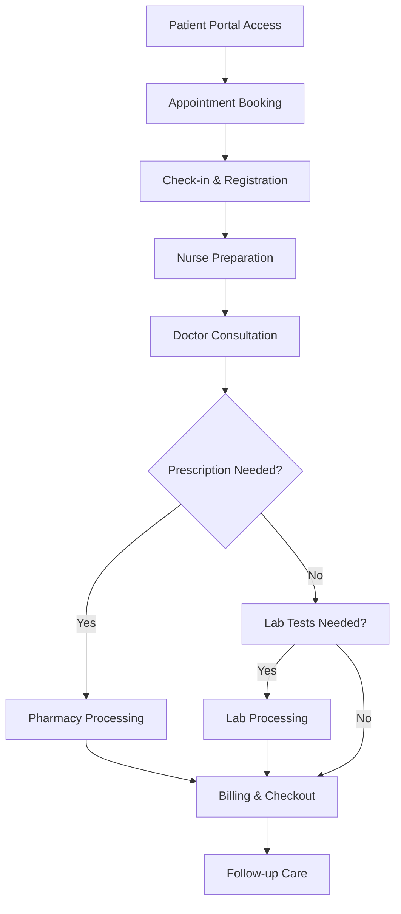
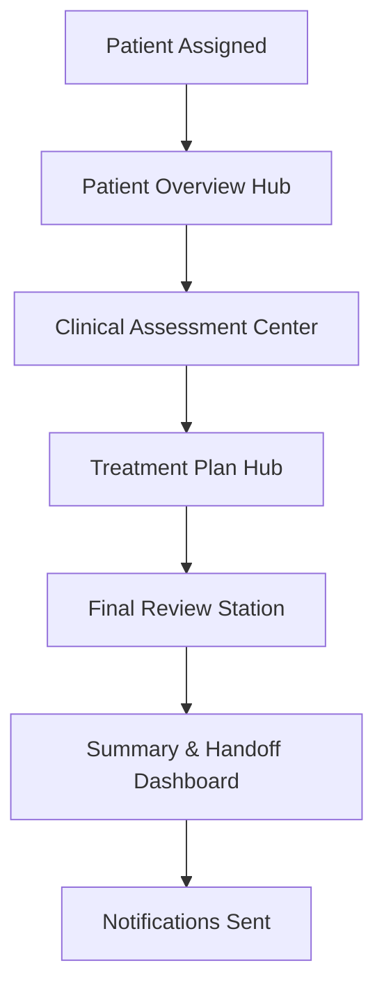
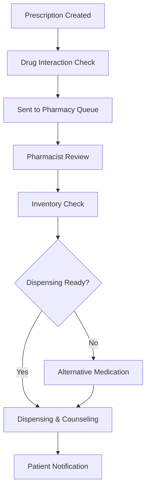

# Functional Requirements Document (FRD)
## AROCORD-HIMS (Healthcare Information Management System)

**Project Name**: AROCORD-HIMS  
**Version**: 2.3  
**Date**: December 2025  
**Status**: Production Ready (90% Complete)  

---

## 1. Introduction

### 1.1 Purpose
This Functional Requirements Document (FRD) provides detailed specifications for all functional features of the AROCORD-HIMS system. It serves as the blueprint for development and testing activities.

### 1.2 Scope
The FRD covers all functional requirements for the 12 core modules and 7 user roles, including workflows, user stories, and acceptance criteria.

---

## 2. System Overview

### 2.1 Core Modules
1. Authentication & Authorization
2. Patient Management
3. Appointment Scheduling
4. Consultation Workflow
5. Prescription Management
6. Pharmacy Operations
7. Laboratory Management
8. Billing & Insurance
9. Notification System
10. Analytics & Reporting
11. Telemedicine
12. Patient Portal

### 2.2 User Roles
- **Patient**: Self-service access to healthcare services
- **Receptionist**: Front-office operations and coordination
- **Nurse**: Clinical support and patient preparation
- **Doctor**: Medical consultations and treatment planning
- **Pharmacist**: Medication dispensing and inventory management
- **Lab Technician**: Laboratory testing and result processing
- **Administrator**: System oversight and analytics

---

## 3. Functional Requirements by Module

### 3.1 Authentication & Authorization

#### **FR-AUTH-001: User Login**
**Description**: System shall provide secure login functionality for all user roles  
**User Story**: As a healthcare provider, I want to securely log into the system so that I can access patient information and perform my duties.  
**Acceptance Criteria**:
- Support username/password authentication
- Implement multi-factor authentication for administrators
- Provide "Remember Me" functionality
- Display appropriate error messages for invalid credentials
- Log all login attempts for security auditing

#### **FR-AUTH-002: Role-Based Access Control**
**Description**: System shall enforce role-based permissions across all modules  
**User Story**: As a system administrator, I want to control what each user can access so that sensitive information is protected.  
**Acceptance Criteria**:
- Define 7 distinct user roles with specific permissions
- Implement route-level protection
- Enforce field-level security for sensitive data
- Support role assignment and modification
- Provide audit trail for permission changes

#### **FR-AUTH-003: Session Management**
**Description**: System shall manage user sessions securely  
**User Story**: As a user, I want my session to remain active during work so that I don't have to log in repeatedly.  
**Acceptance Criteria**:
- Implement automatic session timeout after 30 minutes of inactivity
- Provide session renewal functionality
- Support concurrent session limits
- Enable secure logout from all devices
- Display session expiration warnings

### 3.2 Patient Management

#### **FR-PAT-001: Patient Registration**
**Description**: System shall support comprehensive patient registration  
**User Story**: As a receptionist, I want to register new patients quickly so that they can receive care immediately.  
**Acceptance Criteria**:
- Capture complete demographic information
- Support insurance information entry
- Validate emergency contact details
- Generate unique patient ID
- Allow photo upload for identification

#### **FR-PAT-002: Medical History Management**
**Description**: System shall maintain comprehensive medical histories  
**User Story**: As a doctor, I want to access complete patient medical history so that I can make informed treatment decisions.  
**Acceptance Criteria**:
- Store past diagnoses, treatments, and procedures
- Track medication history and allergies
- Record surgical history and hospitalizations
- Support family medical history
- Enable history updates during consultations

#### **FR-PAT-003: Allergy Management**
**Description**: System shall track and alert on patient allergies  
**User Story**: As a pharmacist, I want to see patient allergies before dispensing so that I can prevent adverse reactions.  
**Acceptance Criteria**:
- Categorize allergies (drug, food, environmental)
- Support severity levels (mild, moderate, severe)
- Display allergy alerts during prescription creation
- Allow allergy updates by authorized staff
- Integrate with drug interaction checking

### 3.3 Appointment Scheduling

#### **FR-APPT-001: Online Booking**
**Description**: System shall provide patient self-service appointment booking  
**User Story**: As a patient, I want to book appointments online so that I can schedule visits at my convenience.  
**Acceptance Criteria**:
- Display available time slots by doctor
- Support appointment type selection
- Provide real-time availability updates
- Send booking confirmations via email/SMS
- Allow booking modifications and cancellations

#### **FR-APPT-002: Receptionist Scheduling**
**Description**: System shall support receptionist-assisted scheduling  
**User Story**: As a receptionist, I want to schedule appointments for patients so that I can optimize the daily schedule.  
**Acceptance Criteria**:
- Provide calendar view with drag-and-drop scheduling
- Support recurring appointment creation
- Enable waitlist management
- Optimize schedules to minimize gaps
- Handle appointment conflicts automatically

#### **FR-APPT-003: Automated Reminders**
**Description**: System shall send automated appointment reminders  
**User Story**: As a patient, I want to receive reminders so that I don't miss my appointments.  
**Acceptance Criteria**:
- Send reminders 24 hours and 1 hour before appointment
- Support multiple channels (SMS, email, in-app)
- Allow reminder customization by patient preference
- Track reminder delivery and responses
- Enable no-show prediction and follow-up

### 3.4 Consultation Workflow

#### **FR-CONS-001: Standard 5-Step Workflow**
**Description**: System shall provide structured 5-step consultation process  
**User Story**: As a doctor, I want a guided consultation workflow so that I don't miss important steps.  
**Acceptance Criteria**:
- **Step 1**: Patient Overview Hub - Display patient context and history
- **Step 2**: Clinical Assessment Center - Record symptoms and examination
- **Step 3**: Treatment Plan Hub - Create diagnosis and treatment plans
- **Step 4**: Final Review Station - Review prescriptions and lab orders
- **Step 5**: Summary & Handoff Dashboard - Complete consultation and trigger notifications

#### **FR-CONS-002: Adaptive Consultation Flow**
**Description**: System shall support intelligent workflow adaptation  
**User Story**: As a doctor, I want the system to skip unnecessary steps so that I can work more efficiently.  
**Acceptance Criteria**:
- Skip vital signs if recorded within 24 hours
- Skip medical history review if updated within 30 days
- Make physical exam required for high-severity symptoms
- Support parallel task execution
- Auto-save data every 30 seconds

#### **FR-CONS-003: Clinical Decision Support**
**Description**: System shall provide clinical guidance during consultations  
**User Story**: As a doctor, I want clinical decision support so that I can provide better care.  
**Acceptance Criteria**:
- Integrate ICD-10 diagnosis search
- Provide treatment guidelines
- Display drug interaction alerts
- Show allergy warnings
- Enable clinical protocol access

### 3.5 Prescription Management

#### **FR-RX-001: Digital Prescription Creation**
**Description**: System shall support electronic prescription writing  
**User Story**: As a doctor, I want to create prescriptions electronically so that they go directly to the pharmacy.  
**Acceptance Criteria**:
- Provide drug database with autocomplete
- Support dosage calculation and units
- Enable frequency and duration specification
- Allow special instructions entry
- Support e-signature requirements

#### **FR-RX-002: Drug Interaction Checking**
**Description**: System shall perform real-time drug interaction analysis  
**User Story**: As a doctor, I want to know about drug interactions before prescribing so that I can ensure patient safety.  
**Acceptance Criteria**:
- Check interactions between prescribed medications
- Alert on drug-disease contraindications
- Flag drug-allergy conflicts
- Display interaction severity levels
- Require acknowledgment for high-risk interactions

#### **FR-RX-003: Prescription Routing**
**Description**: System shall route prescriptions to appropriate pharmacies  
**User Story**: As a patient, I want my prescriptions sent to my preferred pharmacy so that I can pick them up conveniently.  
**Acceptance Criteria**:
- Support pharmacy selection by patient
- Enable priority prescription handling
- Send real-time notifications to pharmacy
- Track prescription status updates
- Support prescription modifications

### 3.6 Pharmacy Operations

#### **FR-PHARM-001: Prescription Queue Management**
**Description**: System shall manage pharmacy workflow queues  
**User Story**: As a pharmacist, I want prescriptions prioritized so that urgent medications are processed first.  
**Acceptance Criteria**:
- Display prescriptions in priority order
- Support multiple queue views (by priority, by doctor, by time)
- Enable prescription claiming by pharmacists
- Track queue wait times and processing metrics
- Support worklist customization

#### **FR-PHARM-002: Inventory Management**
**Description**: System shall track pharmacy inventory and supplies  
**User Story**: As a pharmacist, I want to know when medications are running low so that I can reorder timely.  
**Acceptance Criteria**:
- Track stock levels for all medications
- Generate automatic reorder alerts
- Monitor expiry dates with alerts
- Support batch tracking and recall management
- Enable inventory reporting and analytics

#### **FR-PHARM-003: Dispensing Verification**
**Description**: System shall verify medications before dispensing  
**User Story**: As a pharmacist, I want verification checks so that dispensing errors are prevented.  
**Acceptance Criteria**:
- Verify prescription authenticity
- Check patient allergies against medication
- Confirm dosage appropriateness
- Validate drug interactions
- Require dispensing confirmation

### 3.7 Laboratory Management

#### **FR-LAB-001: Test Order Management**
**Description**: System shall manage laboratory test ordering and processing  
**User Story**: As a doctor, I want to order lab tests easily so that I can get timely results for diagnosis.  
**Acceptance Criteria**:
- Provide searchable test catalog
- Support priority levels (routine, urgent, stat)
- Enable test grouping and panels
- Track order status and processing
- Support order modifications and cancellations

#### **FR-LAB-002: Result Processing**
**Description**: System shall handle laboratory result entry and verification  
**User Story**: As a lab technician, I want an efficient way to enter results so that they reach doctors quickly.  
**Acceptance Criteria**:
- Support batch result entry
- Enable result verification workflows
- Flag abnormal/critical values automatically
- Generate result reports
- Support result amendments and corrections

#### **FR-LAB-003: Critical Value Alerts**
**Description**: System shall alert on critical laboratory values  
**User Story**: As a doctor, I want immediate notification of critical results so that I can respond quickly.  
**Acceptance Criteria**:
- Define critical value thresholds
- Send immediate alerts to ordering physician
- Require alert acknowledgment
- Log alert responses and actions
- Support escalation protocols

### 3.8 Billing & Insurance

#### **FR-BILL-001: Automated Charge Calculation**
**Description**: System shall calculate charges automatically  
**User Story**: As a receptionist, I want charges calculated automatically so that billing is accurate and efficient.  
**Acceptance Criteria**:
- Link services to standard pricing
- Calculate consultation fees based on complexity
- Include medication and lab test charges
- Apply insurance adjustments automatically
- Support manual charge overrides with justification

#### **FR-BILL-002: Insurance Processing**
**Description**: System shall handle insurance claims and processing  
**User Story**: As a billing specialist, I want automated insurance processing so that claims are submitted quickly.  
**Acceptance Criteria**:
- Validate insurance eligibility
- Calculate patient responsibility amounts
- Generate electronic claims (EDI 837)
- Track claim status and payments
- Handle claim denials and appeals

#### **FR-BILL-003: Payment Processing**
**Description**: System shall support multiple payment methods  
**User Story**: As a patient, I want convenient payment options so that I can settle bills easily.  
**Acceptance Criteria**:
- Support credit card, debit card, and digital wallets
- Enable payment plans for large balances
- Process insurance payments automatically
- Generate payment receipts and statements
- Track payment history and aging

### 3.9 Notification System

#### **FR-NOTIF-001: Real-time Notifications**
**Description**: System shall deliver real-time notifications across roles  
**User Story**: As a nurse, I want immediate notification when my patient is ready so that I can provide timely care.  
**Acceptance Criteria**:
- Support WebSocket-based real-time delivery
- Categorize notifications by priority (low, medium, high, urgent)
- Enable notification preferences by user
- Support multiple channels (in-app, SMS, email)
- Maintain notification history and status

#### **FR-NOTIF-002: Smart Notification Routing**
**Description**: System shall route notifications to appropriate recipients  
**User Story**: As a doctor, I want notifications sent to the right people so that tasks are handled efficiently.  
**Acceptance Criteria**:
- Route based on user roles and responsibilities
- Support notification escalation for urgent items
- Enable notification delegation
- Track notification response times
- Support bulk notification management

### 3.10 Analytics & Reporting

#### **FR-ANALYTICS-001: Real-time Dashboards**
**Description**: System shall provide real-time operational dashboards  
**User Story**: As an administrator, I want real-time visibility into operations so that I can make informed decisions.  
**Acceptance Criteria**:
- Display key performance indicators (KPIs)
- Support role-specific dashboard views
- Enable drill-down into detailed data
- Provide real-time data updates
- Support dashboard customization

#### **FR-ANALYTICS-002: Operational Reports**
**Description**: System shall generate comprehensive operational reports  
**User Story**: As a manager, I want detailed reports so that I can analyze performance and identify improvements.  
**Acceptance Criteria**:
- Generate appointment utilization reports
- Track doctor performance metrics
- Monitor queue wait times and patient flow
- Analyze revenue and billing trends
- Support scheduled report delivery

#### **FR-ANALYTICS-003: Clinical Analytics**
**Description**: System shall provide clinical performance insights  
**User Story**: As a clinical director, I want clinical analytics so that I can improve patient care quality.  
**Acceptance Criteria**:
- Track diagnosis and treatment trends
- Monitor clinical outcome measures
- Analyze medication usage patterns
- Support quality improvement initiatives
- Enable comparative performance analysis

### 3.11 Telemedicine

#### **FR-TELE-001: Video Consultations**
**Description**: System shall support video-based consultations  
**User Story**: As a patient, I want video consultations so that I can receive care from home when appropriate.  
**Acceptance Criteria**:
- Support HD video with screen sharing
- Enable virtual waiting rooms
- Provide consultation recording capabilities
- Support multi-device access
- Ensure HIPAA-compliant video security

#### **FR-TELE-002: Remote Monitoring Integration**
**Description**: System shall integrate with remote monitoring devices  
**User Story**: As a doctor, I want to see patient vital signs remotely so that I can monitor chronic conditions.  
**Acceptance Criteria**:
- Support integration with wearable devices
- Display real-time vital sign data
- Enable remote vital sign monitoring
- Support alert configuration for abnormal readings
- Maintain data security and privacy

### 3.12 Patient Portal

#### **FR-PORTAL-001: Self-Service Access**
**Description**: System shall provide comprehensive patient self-service  
**User Story**: As a patient, I want easy access to my health information so that I can manage my care actively.  
**Acceptance Criteria**:
- Provide secure login with patient verification
- Display complete medical history and records
- Enable appointment booking and management
- Support prescription viewing and refill requests
- Allow secure messaging with providers

#### **FR-PORTAL-002: Health Tracking**
**Description**: System shall enable patient health monitoring  
**User Story**: As a patient, I want to track my health metrics so that I can stay informed about my condition.  
**Acceptance Criteria**:
- Support medication adherence tracking
- Enable symptom logging and reporting
- Provide lab result access and trends
- Support health goal setting and tracking
- Generate health summary reports

---

## 4. User Stories and Acceptance Criteria

### 4.1 Patient User Stories

**US-PAT-001**: As a patient, I want to book appointments online so that I can schedule visits at convenient times.  
**Acceptance Criteria**:
- Patient can access booking system 24/7
- Real-time availability display
- Confirmation sent via preferred channel
- Easy rescheduling and cancellation options

**US-PAT-002**: As a patient, I want to access my medical records so that I can stay informed about my health.  
**Acceptance Criteria**:
- Secure access to complete medical history
- Downloadable records in PDF format
- Timeline view of medical events
- Privacy controls for sensitive information

### 4.2 Doctor User Stories

**US-DOC-001**: As a doctor, I want guided consultation workflow so that I provide consistent, comprehensive care.  
**Acceptance Criteria**:
- Step-by-step guidance through consultation
- Automatic data saving and state management
- Integration with clinical decision support
- Seamless handoff to other departments

**US-DOC-002**: As a doctor, I want drug interaction alerts so that I can prescribe safely.  
**Acceptance Criteria**:
- Real-time interaction checking
- Severity-based alert prioritization
- Alternative medication suggestions
- Documentation of alert acknowledgments

### 4.3 Pharmacy User Stories

**US-PHARM-001**: As a pharmacist, I want prescription queue management so that I can prioritize urgent medications.  
**Acceptance Criteria**:
- Priority-based queue sorting
- Real-time queue updates
- Work claiming and assignment
- Queue performance metrics

### 4.4 Administrative User Stories

**US-ADMIN-001**: As an administrator, I want comprehensive analytics so that I can optimize operations.  
**Acceptance Criteria**:
- Real-time KPI dashboards
- Custom report generation
- Trend analysis and forecasting
- Performance benchmarking

---

## 5. Workflows

### 5.1 Patient Journey Workflow

### 5.2 Consultation Workflow

### 5.3 Prescription Workflow

---

## 6. Data Requirements

### 6.1 Data Entities
- **Patient**: Demographics, medical history, insurance, contacts
- **Appointment**: Schedule, status, participants, notes
- **Consultation**: Steps, data, timestamps, outcomes
- **Prescription**: Medications, dosages, instructions, status
- **Lab Order**: Tests, priorities, results, timestamps
- **Notification**: Content, recipients, status, priority

### 6.2 Data Validation Rules
- Required fields for critical patient information
- Format validation for phone numbers and emails
- Range validation for vital signs and dosages
- Business rule validation for appointment scheduling
- Cross-reference validation for drug interactions

---

## 7. Integration Requirements

### 7.1 External Systems
- **Drug Databases**: For medication information and interactions
- **Insurance Systems**: For eligibility and claims processing
- **Lab Systems**: For test ordering and result retrieval
- **Payment Gateways**: For secure payment processing
- **SMS/Email Services**: For notification delivery

### 7.2 Internal Modules
- **Authentication**: Single sign-on across modules
- **Notification**: Centralized notification management
- **Analytics**: Cross-module data aggregation
- **Audit**: Comprehensive audit trail across all operations

---

## 8. Performance Requirements

### 8.1 Response Times
- Page loads: <2 seconds
- Data retrieval: <1 second
- Real-time notifications: <500ms
- Report generation: <30 seconds
- Search operations: <500ms

### 8.2 Throughput
- Concurrent users: 500+
- Transactions per minute: 1000+
- Notification delivery: 1000/minute
- Report processing: 100 concurrent

---

## 9. Security Requirements

### 9.1 Access Control
- Role-based permissions for all functions
- Field-level security for sensitive data
- Session management with automatic timeout
- Audit logging for all data access

### 9.2 Data Protection
- Encryption at rest and in transit
- HIPAA compliance for health data
- Secure API communications
- Regular security assessments

---

## 10. Testing Requirements

### 10.1 Unit Testing
- 90%+ code coverage requirement
- Test all business logic functions
- Validate data transformations
- Test error handling scenarios

### 10.2 Integration Testing
- End-to-end workflow validation
- Cross-module data flow testing
- External system integration testing
- Performance under load testing

### 10.3 User Acceptance Testing
- Role-based scenario testing
- Usability and accessibility testing
- Performance validation
- Security and compliance testing

---

## 11. Change Management

### 11.1 Requirement Changes
- All changes must be documented and approved
- Impact assessment required for scope changes
- Regression testing for modified requirements
- Version control for requirement documents

### 11.2 Traceability
- Link requirements to user stories
- Connect requirements to test cases
- Map requirements to code components
- Track requirement implementation status

---

## 12. Approval and Sign-off

**Product Manager**: ___________________________ Date: ____________

**Development Lead**: ___________________________ Date: ____________

**QA Lead**: ___________________________ Date: ____________

**Business Analyst**: ___________________________ Date: ____________

---

**Document Control**  
**Version**: 1.0  
**Last Updated**: December 2025  
**Next Review**: March 2026  
**Document Owner**: Requirements Management Team