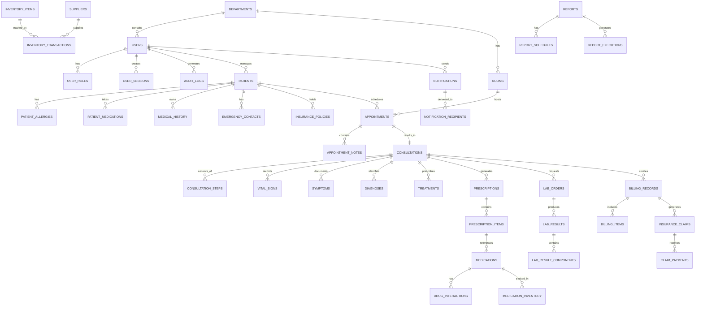

# Database Schema Design
## AROCORD-HIMS (Healthcare Information Management System)

## Document Information
- **Document Version**: 1.0
- **Date**: January 2025
- **Project Name**: AROCORD-HIMS
- **Database**: PostgreSQL 15.x
- **Document Owner**: Database Architecture Team

---

## 1. Introduction

### 1.1 Purpose
This Database Schema Design document provides a comprehensive overview of the AROCORD-HIMS database structure, including entity relationships, table definitions, indexes, constraints, and data integrity rules.

### 1.2 Scope
This document covers:
- Entity-Relationship Diagrams (ERD)
- Table schemas and definitions
- Primary and foreign key relationships
- Indexes and performance optimization
- Data types and constraints
- Partitioning strategies
- Security considerations

### 1.3 Database Design Principles

#### 1.3.1 Normalization
- **3NF (Third Normal Form)**: Eliminates transitive dependencies
- **Data Integrity**: Referential integrity enforced through foreign keys
- **Consistency**: ACID properties maintained for transactional data

#### 1.3.2 Performance Optimization
- **Indexing Strategy**: Strategic indexes for query performance
- **Partitioning**: Time-based partitioning for large tables
- **Caching**: Redis integration for frequently accessed data

#### 1.3.3 Security
- **Data Encryption**: Sensitive data encrypted at rest
- **Access Control**: Row-level security (RLS) implementation
- **Audit Logging**: Comprehensive audit trails

#### 1.3.4 Scalability
- **Horizontal Scaling**: Read replicas for query distribution
- **Sharding**: Database sharding for large datasets
- **Archiving**: Automated archiving for historical data

---

## 2. Entity-Relationship Diagram



---

## 3. Core Tables

### 3.1 User Management Tables

#### users
```sql
CREATE TABLE users (
    id UUID PRIMARY KEY DEFAULT gen_random_uuid(),
    email VARCHAR(255) UNIQUE NOT NULL,
    password_hash VARCHAR(255) NOT NULL,
    first_name VARCHAR(100) NOT NULL,
    last_name VARCHAR(100) NOT NULL,
    phone VARCHAR(20),
    avatar_url VARCHAR(500),
    role_id UUID NOT NULL REFERENCES user_roles(id),
    department_id UUID REFERENCES departments(id),
    is_active BOOLEAN DEFAULT true,
    is_email_verified BOOLEAN DEFAULT false,
    last_login_at TIMESTAMP WITH TIME ZONE,
    password_changed_at TIMESTAMP WITH TIME ZONE DEFAULT CURRENT_TIMESTAMP,
    created_at TIMESTAMP WITH TIME ZONE DEFAULT CURRENT_TIMESTAMP,
    updated_at TIMESTAMP WITH TIME ZONE DEFAULT CURRENT_TIMESTAMP,
    created_by UUID REFERENCES users(id),
    updated_by UUID REFERENCES users(id)
);

-- Indexes
CREATE INDEX idx_users_email ON users(email);
CREATE INDEX idx_users_role ON users(role_id);
CREATE INDEX idx_users_department ON users(department_id);
CREATE INDEX idx_users_active ON users(is_active);
CREATE INDEX idx_users_last_login ON users(last_login_at);

-- Row Level Security
ALTER TABLE users ENABLE ROW LEVEL SECURITY;
```

#### user_roles
```sql
CREATE TABLE user_roles (
    id UUID PRIMARY KEY DEFAULT gen_random_uuid(),
    name VARCHAR(50) UNIQUE NOT NULL,
    display_name VARCHAR(100) NOT NULL,
    description TEXT,
    permissions JSONB NOT NULL DEFAULT '{}',
    is_system_role BOOLEAN DEFAULT false,
    created_at TIMESTAMP WITH TIME ZONE DEFAULT CURRENT_TIMESTAMP,
    updated_at TIMESTAMP WITH TIME ZONE DEFAULT CURRENT_TIMESTAMP
);

-- Insert default roles
INSERT INTO user_roles (name, display_name, description, permissions) VALUES
('patient', 'Patient', 'Self-service patient access', '{"read": ["own_records"], "update": ["own_profile"]}'),
('receptionist', 'Receptionist', 'Front desk operations', '{"create": ["patients", "appointments"], "read": ["all_patients", "all_appointments"], "update": ["patient_demographics", "appointment_status"]}'),
('nurse', 'Nurse', 'Clinical support staff', '{"create": ["vital_signs", "patient_notes"], "read": ["assigned_patients"], "update": ["patient_status", "vital_signs"]}'),
('doctor', 'Doctor', 'Medical practitioner', '{"create": ["consultations", "prescriptions", "lab_orders"], "read": ["all_patients"], "update": ["consultation_status", "treatment_plans"]}'),
('pharmacist', 'Pharmacist', 'Medication dispensing', '{"create": ["medication_dispensing"], "read": ["prescriptions", "inventory"], "update": ["prescription_status", "inventory_levels"]}'),
('lab_technician', 'Lab Technician', 'Laboratory operations', '{"create": ["lab_results"], "read": ["lab_orders"], "update": ["lab_order_status", "result_status"]}'),
('administrator', 'Administrator', 'System administration', '{"create": ["users", "departments"], "read": ["all_data"], "update": ["system_settings", "user_permissions"], "delete": ["users", "records"]}');
```

### 3.2 Patient Management Tables

#### patients
```sql
CREATE TABLE patients (
    id UUID PRIMARY KEY DEFAULT gen_random_uuid(),
    mrn VARCHAR(20) UNIQUE NOT NULL, -- Medical Record Number
    first_name VARCHAR(100) NOT NULL,
    last_name VARCHAR(100) NOT NULL,
    middle_name VARCHAR(100),
    date_of_birth DATE NOT NULL,
    gender VARCHAR(20) CHECK (gender IN ('male', 'female', 'other', 'unknown')),
    ssn VARCHAR(11), -- Encrypted
    email VARCHAR(255),
    phone_primary VARCHAR(20),
    phone_secondary VARCHAR(20),
    address_line_1 VARCHAR(255),
    address_line_2 VARCHAR(255),
    city VARCHAR(100),
    state VARCHAR(50),
    postal_code VARCHAR(20),
    country VARCHAR(50) DEFAULT 'US',
    marital_status VARCHAR(20),
    occupation VARCHAR(100),
    emergency_contact_name VARCHAR(200),
    emergency_contact_relationship VARCHAR(50),
    emergency_contact_phone VARCHAR(20),
    preferred_language VARCHAR(50) DEFAULT 'en',
    ethnicity VARCHAR(50),
    race VARCHAR(50),
    blood_type VARCHAR(10),
    organ_donor BOOLEAN DEFAULT false,
    advance_directive BOOLEAN DEFAULT false,
    created_at TIMESTAMP WITH TIME ZONE DEFAULT CURRENT_TIMESTAMP,
    updated_at TIMESTAMP WITH TIME ZONE DEFAULT CURRENT_TIMESTAMP,
    created_by UUID REFERENCES users(id),
    updated_by UUID REFERENCES users(id)
);

-- Indexes
CREATE INDEX idx_patients_mrn ON patients(mrn);
CREATE INDEX idx_patients_name ON patients(last_name, first_name);
CREATE INDEX idx_patients_dob ON patients(date_of_birth);
CREATE INDEX idx_patients_phone ON patients(phone_primary);
CREATE INDEX idx_patients_email ON patients(email);

-- Partitioning (by year of creation for large datasets)
-- CREATE TABLE patients_y2024 PARTITION OF patients FOR VALUES FROM ('2024-01-01') TO ('2025-01-01');
```

#### patient_allergies
```sql
CREATE TABLE patient_allergies (
    id UUID PRIMARY KEY DEFAULT gen_random_uuid(),
    patient_id UUID NOT NULL REFERENCES patients(id) ON DELETE CASCADE,
    allergen_type VARCHAR(50) NOT NULL, -- drug, food, environmental, etc.
    allergen_name VARCHAR(200) NOT NULL,
    severity VARCHAR(20) CHECK (severity IN ('mild', 'moderate', 'severe', 'life_threatening')),
    reaction_description TEXT,
    onset_date DATE,
    reported_by UUID REFERENCES users(id),
    is_active BOOLEAN DEFAULT true,
    created_at TIMESTAMP WITH TIME ZONE DEFAULT CURRENT_TIMESTAMP,
    updated_at TIMESTAMP WITH TIME ZONE DEFAULT CURRENT_TIMESTAMP
);

-- Indexes
CREATE INDEX idx_patient_allergies_patient ON patient_allergies(patient_id);
CREATE INDEX idx_patient_allergies_allergen ON patient_allergies(allergen_name);
CREATE INDEX idx_patient_allergies_active ON patient_allergies(is_active);
```

### 3.3 Appointment and Scheduling Tables

#### appointments
```sql
CREATE TABLE appointments (
    id UUID PRIMARY KEY DEFAULT gen_random_uuid(),
    patient_id UUID NOT NULL REFERENCES patients(id),
    provider_id UUID NOT NULL REFERENCES users(id),
    department_id UUID REFERENCES departments(id),
    room_id UUID REFERENCES rooms(id),
    appointment_type VARCHAR(50) NOT NULL,
    scheduled_date DATE NOT NULL,
    scheduled_time TIME NOT NULL,
    duration_minutes INTEGER NOT NULL DEFAULT 15,
    status VARCHAR(30) DEFAULT 'scheduled' CHECK (status IN ('scheduled', 'confirmed', 'checked_in', 'in_progress', 'completed', 'cancelled', 'no_show')),
    priority VARCHAR(20) DEFAULT 'normal' CHECK (priority IN ('low', 'normal', 'high', 'urgent', 'emergency')),
    reason_for_visit TEXT,
    special_instructions TEXT,
    insurance_verified BOOLEAN DEFAULT false,
    created_at TIMESTAMP WITH TIME ZONE DEFAULT CURRENT_TIMESTAMP,
    updated_at TIMESTAMP WITH TIME ZONE DEFAULT CURRENT_TIMESTAMP,
    created_by UUID REFERENCES users(id),
    updated_by UUID REFERENCES users(id),
    cancelled_at TIMESTAMP WITH TIME ZONE,
    cancelled_by UUID REFERENCES users(id),
    cancellation_reason TEXT
);

-- Indexes
CREATE INDEX idx_appointments_patient ON appointments(patient_id);
CREATE INDEX idx_appointments_provider ON appointments(provider_id);
CREATE INDEX idx_appointments_date ON appointments(scheduled_date);
CREATE INDEX idx_appointments_datetime ON appointments(scheduled_date, scheduled_time);
CREATE INDEX idx_appointments_status ON appointments(status);
CREATE INDEX idx_appointments_department ON appointments(department_id);

-- Constraints
ALTER TABLE appointments ADD CONSTRAINT chk_appointment_duration CHECK (duration_minutes > 0 AND duration_minutes <= 480);
ALTER TABLE appointments ADD CONSTRAINT chk_no_double_booking EXCLUDE (provider_id WITH =, scheduled_date WITH =, tstzrange(scheduled_time, scheduled_time + (duration_minutes || ' minutes')::INTERVAL) WITH &&) WHERE (status NOT IN ('cancelled', 'no_show'));
```

### 3.4 Consultation and Clinical Tables

#### consultations
```sql
CREATE TABLE consultations (
    id UUID PRIMARY KEY DEFAULT gen_random_uuid(),
    appointment_id UUID REFERENCES appointments(id),
    patient_id UUID NOT NULL REFERENCES patients(id),
    provider_id UUID NOT NULL REFERENCES users(id),
    consultation_type VARCHAR(50) DEFAULT 'standard',
    workflow_type VARCHAR(20) DEFAULT 'standard' CHECK (workflow_type IN ('standard', 'adaptive')),
    chief_complaint TEXT,
    history_of_present_illness TEXT,
    review_of_systems JSONB,
    physical_examination JSONB,
    assessment TEXT,
    plan TEXT,
    status VARCHAR(30) DEFAULT 'in_progress' CHECK (status IN ('scheduled', 'in_progress', 'completed', 'cancelled')),
    started_at TIMESTAMP WITH TIME ZONE,
    completed_at TIMESTAMP WITH TIME ZONE,
    total_duration_minutes INTEGER,
    created_at TIMESTAMP WITH TIME ZONE DEFAULT CURRENT_TIMESTAMP,
    updated_at TIMESTAMP WITH TIME ZONE DEFAULT CURRENT_TIMESTAMP,
    created_by UUID REFERENCES users(id),
    updated_by UUID REFERENCES users(id)
);

-- Indexes
CREATE INDEX idx_consultations_patient ON consultations(patient_id);
CREATE INDEX idx_consultations_provider ON consultations(provider_id);
CREATE INDEX idx_consultations_appointment ON consultations(appointment_id);
CREATE INDEX idx_consultations_status ON consultations(status);
CREATE INDEX idx_consultations_date ON consultations(started_at);
```

#### vital_signs
```sql
CREATE TABLE vital_signs (
    id UUID PRIMARY KEY DEFAULT gen_random_uuid(),
    consultation_id UUID REFERENCES consultations(id),
    patient_id UUID NOT NULL REFERENCES patients(id),
    recorded_by UUID NOT NULL REFERENCES users(id),
    recorded_at TIMESTAMP WITH TIME ZONE DEFAULT CURRENT_TIMESTAMP,
    blood_pressure_systolic INTEGER,
    blood_pressure_diastolic INTEGER,
    heart_rate INTEGER,
    respiratory_rate INTEGER,
    temperature DECIMAL(4,1),
    temperature_unit VARCHAR(5) DEFAULT 'F' CHECK (temperature_unit IN ('F', 'C')),
    oxygen_saturation INTEGER,
    oxygen_supplement BOOLEAN DEFAULT false,
    oxygen_flow_rate DECIMAL(3,1),
    weight_kg DECIMAL(5,2),
    height_cm DECIMAL(5,2),
    bmi DECIMAL(4,1) GENERATED ALWAYS AS (
        CASE
            WHEN weight_kg > 0 AND height_cm > 0
            THEN ROUND((weight_kg / POWER(height_cm / 100, 2))::NUMERIC, 1)
            ELSE NULL
        END
    ) STORED,
    pain_scale INTEGER CHECK (pain_scale >= 0 AND pain_scale <= 10),
    notes TEXT
);

-- Indexes
CREATE INDEX idx_vital_signs_patient ON vital_signs(patient_id);
CREATE INDEX idx_vital_signs_consultation ON vital_signs(consultation_id);
CREATE INDEX idx_vital_signs_recorded_at ON vital_signs(recorded_at);
```

### 3.5 Prescription and Medication Tables

#### prescriptions
```sql
CREATE TABLE prescriptions (
    id UUID PRIMARY KEY DEFAULT gen_random_uuid(),
    consultation_id UUID REFERENCES consultations(id),
    patient_id UUID NOT NULL REFERENCES patients(id),
    provider_id UUID NOT NULL REFERENCES users(id),
    prescription_number VARCHAR(50) UNIQUE,
    status VARCHAR(30) DEFAULT 'pending' CHECK (status IN ('pending', 'sent_to_pharmacy', 'ready', 'dispensed', 'cancelled')),
    priority VARCHAR(20) DEFAULT 'normal' CHECK (priority IN ('low', 'normal', 'high', 'urgent')),
    notes TEXT,
    created_at TIMESTAMP WITH TIME ZONE DEFAULT CURRENT_TIMESTAMP,
    updated_at TIMESTAMP WITH TIME ZONE DEFAULT CURRENT_TIMESTAMP,
    created_by UUID REFERENCES users(id),
    updated_by UUID REFERENCES users(id)
);

-- Indexes
CREATE INDEX idx_prescriptions_patient ON prescriptions(patient_id);
CREATE INDEX idx_prescriptions_provider ON prescriptions(provider_id);
CREATE INDEX idx_prescriptions_consultation ON prescriptions(consultation_id);
CREATE INDEX idx_prescriptions_status ON prescriptions(status);
CREATE INDEX idx_prescriptions_number ON prescriptions(prescription_number);
```

#### medications
```sql
CREATE TABLE medications (
    id UUID PRIMARY KEY DEFAULT gen_random_uuid(),
    name VARCHAR(200) NOT NULL,
    generic_name VARCHAR(200),
    brand_name VARCHAR(200),
    strength VARCHAR(50),
    form VARCHAR(50), -- tablet, capsule, liquid, etc.
    route VARCHAR(50), -- oral, iv, topical, etc.
    drug_class VARCHAR(100),
    controlled_substance BOOLEAN DEFAULT false,
    dea_schedule VARCHAR(5),
    requires_prescription BOOLEAN DEFAULT true,
    is_active BOOLEAN DEFAULT true,
    created_at TIMESTAMP WITH TIME ZONE DEFAULT CURRENT_TIMESTAMP,
    updated_at TIMESTAMP WITH TIME ZONE DEFAULT CURRENT_TIMESTAMP
);

-- Indexes
CREATE INDEX idx_medications_name ON medications(name);
CREATE INDEX idx_medications_generic ON medications(generic_name);
CREATE INDEX idx_medications_class ON medications(drug_class);
CREATE INDEX idx_medications_active ON medications(is_active);
```

### 3.6 Laboratory Tables

#### lab_orders
```sql
CREATE TABLE lab_orders (
    id UUID PRIMARY KEY DEFAULT gen_random_uuid(),
    consultation_id UUID REFERENCES consultations(id),
    patient_id UUID NOT NULL REFERENCES patients(id),
    provider_id UUID NOT NULL REFERENCES users(id),
    order_number VARCHAR(50) UNIQUE,
    status VARCHAR(30) DEFAULT 'ordered' CHECK (status IN ('ordered', 'collected', 'in_progress', 'completed', 'cancelled')),
    priority VARCHAR(20) DEFAULT 'normal' CHECK (priority IN ('low', 'normal', 'high', 'urgent', 'stat')),
    collection_date DATE,
    collection_time TIME,
    collected_by UUID REFERENCES users(id),
    collected_at TIMESTAMP WITH TIME ZONE,
    notes TEXT,
    created_at TIMESTAMP WITH TIME ZONE DEFAULT CURRENT_TIMESTAMP,
    updated_at TIMESTAMP WITH TIME ZONE DEFAULT CURRENT_TIMESTAMP,
    created_by UUID REFERENCES users(id),
    updated_by UUID REFERENCES users(id)
);

-- Indexes
CREATE INDEX idx_lab_orders_patient ON lab_orders(patient_id);
CREATE INDEX idx_lab_orders_provider ON lab_orders(provider_id);
CREATE INDEX idx_lab_orders_consultation ON lab_orders(consultation_id);
CREATE INDEX idx_lab_orders_status ON lab_orders(status);
CREATE INDEX idx_lab_orders_priority ON lab_orders(priority);
CREATE INDEX idx_lab_orders_number ON lab_orders(order_number);
```

#### lab_results
```sql
CREATE TABLE lab_results (
    id UUID PRIMARY KEY DEFAULT gen_random_uuid(),
    lab_order_id UUID NOT NULL REFERENCES lab_orders(id),
    test_code VARCHAR(20) NOT NULL,
    test_name VARCHAR(200) NOT NULL,
    status VARCHAR(30) DEFAULT 'pending' CHECK (status IN ('pending', 'in_progress', 'completed', 'reviewed', 'critical')),
    result_value VARCHAR(100),
    result_unit VARCHAR(20),
    reference_range VARCHAR(100),
    flag VARCHAR(20) CHECK (flag IN ('normal', 'low', 'high', 'critical_low', 'critical_high')),
    performed_by UUID REFERENCES users(id),
    performed_at TIMESTAMP WITH TIME ZONE,
    reviewed_by UUID REFERENCES users(id),
    reviewed_at TIMESTAMP WITH TIME ZONE,
    notes TEXT,
    created_at TIMESTAMP WITH TIME ZONE DEFAULT CURRENT_TIMESTAMP,
    updated_at TIMESTAMP WITH TIME ZONE DEFAULT CURRENT_TIMESTAMP
);

-- Indexes
CREATE INDEX idx_lab_results_order ON lab_results(lab_order_id);
CREATE INDEX idx_lab_results_test ON lab_results(test_code);
CREATE INDEX idx_lab_results_status ON lab_results(status);
CREATE INDEX idx_lab_results_flag ON lab_results(flag);
CREATE INDEX idx_lab_results_performed_at ON lab_results(performed_at);
```

### 3.7 Billing and Insurance Tables

#### billing_records
```sql
CREATE TABLE billing_records (
    id UUID PRIMARY KEY DEFAULT gen_random_uuid(),
    consultation_id UUID REFERENCES consultations(id),
    patient_id UUID NOT NULL REFERENCES patients(id),
    invoice_number VARCHAR(50) UNIQUE,
    status VARCHAR(30) DEFAULT 'pending' CHECK (status IN ('pending', 'billed', 'paid', 'partially_paid', 'cancelled', 'written_off')),
    total_amount DECIMAL(10,2) NOT NULL,
    tax_amount DECIMAL(10,2) DEFAULT 0,
    discount_amount DECIMAL(10,2) DEFAULT 0,
    paid_amount DECIMAL(10,2) DEFAULT 0,
    balance_amount DECIMAL(10,2) GENERATED ALWAYS AS (total_amount + tax_amount - discount_amount - paid_amount) STORED,
    due_date DATE,
    billed_at TIMESTAMP WITH TIME ZONE DEFAULT CURRENT_TIMESTAMP,
    created_at TIMESTAMP WITH TIME ZONE DEFAULT CURRENT_TIMESTAMP,
    updated_at TIMESTAMP WITH TIME ZONE DEFAULT CURRENT_TIMESTAMP,
    created_by UUID REFERENCES users(id),
    updated_by UUID REFERENCES users(id)
);

-- Indexes
CREATE INDEX idx_billing_records_patient ON billing_records(patient_id);
CREATE INDEX idx_billing_records_consultation ON billing_records(consultation_id);
CREATE INDEX idx_billing_records_status ON billing_records(status);
CREATE INDEX idx_billing_records_invoice ON billing_records(invoice_number);
CREATE INDEX idx_billing_records_due_date ON billing_records(due_date);
```

### 3.8 Notification and Communication Tables

#### notifications
```sql
CREATE TABLE notifications (
    id UUID PRIMARY KEY DEFAULT gen_random_uuid(),
    type VARCHAR(50) NOT NULL, -- appointment, medication, lab_result, system, etc.
    priority VARCHAR(20) DEFAULT 'normal' CHECK (priority IN ('low', 'normal', 'high', 'urgent')),
    title VARCHAR(200) NOT NULL,
    message TEXT NOT NULL,
    action_url VARCHAR(500),
    action_label VARCHAR(100),
    expires_at TIMESTAMP WITH TIME ZONE,
    created_at TIMESTAMP WITH TIME ZONE DEFAULT CURRENT_TIMESTAMP,
    created_by UUID REFERENCES users(id)
);

-- Indexes
CREATE INDEX idx_notifications_type ON notifications(type);
CREATE INDEX idx_notifications_priority ON notifications(priority);
CREATE INDEX idx_notifications_created_at ON notifications(created_at);
CREATE INDEX idx_notifications_expires_at ON notifications(expires_at);
```

#### notification_recipients
```sql
CREATE TABLE notification_recipients (
    id UUID PRIMARY KEY DEFAULT gen_random_uuid(),
    notification_id UUID NOT NULL REFERENCES notifications(id) ON DELETE CASCADE,
    recipient_id UUID NOT NULL REFERENCES users(id),
    channel VARCHAR(20) NOT NULL CHECK (channel IN ('in_app', 'email', 'sms', 'push')),
    status VARCHAR(20) DEFAULT 'pending' CHECK (status IN ('pending', 'sent', 'delivered', 'read', 'failed')),
    sent_at TIMESTAMP WITH TIME ZONE,
    delivered_at TIMESTAMP WITH TIME ZONE,
    read_at TIMESTAMP WITH TIME ZONE,
    failed_at TIMESTAMP WITH TIME ZONE,
    failure_reason TEXT,
    created_at TIMESTAMP WITH TIME ZONE DEFAULT CURRENT_TIMESTAMP
);

-- Indexes
CREATE INDEX idx_notification_recipients_notification ON notification_recipients(notification_id);
CREATE INDEX idx_notification_recipients_recipient ON notification_recipients(recipient_id);
CREATE INDEX idx_notification_recipients_channel ON notification_recipients(channel);
CREATE INDEX idx_notification_recipients_status ON notification_recipients(status);
```

### 3.9 Audit and Security Tables

#### audit_logs
```sql
CREATE TABLE audit_logs (
    id UUID PRIMARY KEY DEFAULT gen_random_uuid(),
    user_id UUID REFERENCES users(id),
    session_id UUID,
    action VARCHAR(100) NOT NULL,
    resource_type VARCHAR(50) NOT NULL,
    resource_id UUID,
    old_values JSONB,
    new_values JSONB,
    ip_address INET,
    user_agent TEXT,
    timestamp TIMESTAMP WITH TIME ZONE DEFAULT CURRENT_TIMESTAMP,
    success BOOLEAN DEFAULT true,
    error_message TEXT
);

-- Indexes
CREATE INDEX idx_audit_logs_user ON audit_logs(user_id);
CREATE INDEX idx_audit_logs_action ON audit_logs(action);
CREATE INDEX idx_audit_logs_resource ON audit_logs(resource_type, resource_id);
CREATE INDEX idx_audit_logs_timestamp ON audit_logs(timestamp);

-- Partitioning by month for large audit logs
-- CREATE TABLE audit_logs_y2024m01 PARTITION OF audit_logs FOR VALUES FROM ('2024-01-01') TO ('2024-02-01');
```

---

## 4. Database Optimization

### 4.1 Indexing Strategy

#### 4.1.1 Primary Performance Indexes
```sql
-- Composite indexes for common query patterns
CREATE INDEX CONCURRENTLY idx_appointments_provider_date_time ON appointments(provider_id, scheduled_date, scheduled_time);
CREATE INDEX CONCURRENTLY idx_consultations_patient_date ON consultations(patient_id, started_at DESC);
CREATE INDEX CONCURRENTLY idx_lab_results_order_test ON lab_results(lab_order_id, test_code);
CREATE INDEX CONCURRENTLY idx_billing_records_patient_status ON billing_records(patient_id, status);

-- Partial indexes for active records
CREATE INDEX CONCURRENTLY idx_active_appointments ON appointments(scheduled_date, scheduled_time) WHERE status IN ('scheduled', 'confirmed');
CREATE INDEX CONCURRENTLY idx_active_prescriptions ON prescriptions(created_at) WHERE status NOT IN ('dispensed', 'cancelled');

-- JSONB indexes for flexible data
CREATE INDEX CONCURRENTLY idx_user_permissions ON user_roles USING GIN(permissions);
CREATE INDEX CONCURRENTLY idx_consultation_physical_exam ON consultations USING GIN(physical_examination);
```

#### 4.1.2 Full-Text Search Indexes
```sql
-- Full-text search for patient records
CREATE INDEX CONCURRENTLY idx_patients_fulltext ON patients USING GIN(to_tsvector('english', first_name || ' ' || last_name || ' ' || COALESCE(email, '') || ' ' || COALESCE(phone_primary, '')));

-- Full-text search for medical notes
CREATE INDEX CONCURRENTLY idx_consultations_fulltext ON consultations USING GIN(to_tsvector('english', chief_complaint || ' ' || COALESCE(history_of_present_illness, '') || ' ' || COALESCE(assessment, '') || ' ' || COALESCE(plan, '')));
```

### 4.2 Partitioning Strategy

#### 4.2.1 Time-Based Partitioning
```sql
-- Partition audit logs by month
CREATE TABLE audit_logs_y2024m01 PARTITION OF audit_logs
    FOR VALUES FROM ('2024-01-01') TO ('2024-02-01');

-- Partition appointments by quarter
CREATE TABLE appointments_q1_2024 PARTITION OF appointments
    FOR VALUES FROM ('2024-01-01') TO ('2024-04-01');

-- Automatic partition creation function
CREATE OR REPLACE FUNCTION create_monthly_partition(
    table_name TEXT,
    start_date DATE
) RETURNS VOID AS $$
DECLARE
    partition_name TEXT;
    end_date DATE;
BEGIN
    partition_name := table_name || '_y' || EXTRACT(YEAR FROM start_date) || 'm' || LPAD(EXTRACT(MONTH FROM start_date)::TEXT, 2, '0');
    end_date := start_date + INTERVAL '1 month';

    EXECUTE format('CREATE TABLE IF NOT EXISTS %I PARTITION OF %I FOR VALUES FROM (%L) TO (%L)',
                   partition_name, table_name, start_date, end_date);
END;
$$ LANGUAGE plpgsql;
```

### 4.3 Data Archiving Strategy

#### 4.3.1 Archive Tables
```sql
-- Archive completed consultations older than 7 years
CREATE TABLE consultations_archive (LIKE consultations INCLUDING ALL);

-- Archive completed billing records older than 7 years
CREATE TABLE billing_records_archive (LIKE billing_records INCLUDING ALL);

-- Automated archiving function
CREATE OR REPLACE FUNCTION archive_old_records() RETURNS VOID AS $$
BEGIN
    -- Archive old consultations
    INSERT INTO consultations_archive
    SELECT * FROM consultations
    WHERE completed_at < CURRENT_DATE - INTERVAL '7 years'
    AND status = 'completed';

    DELETE FROM consultations
    WHERE completed_at < CURRENT_DATE - INTERVAL '7 years'
    AND status = 'completed';

    -- Archive old billing records
    INSERT INTO billing_records_archive
    SELECT * FROM billing_records
    WHERE billed_at < CURRENT_DATE - INTERVAL '7 years'
    AND status IN ('paid', 'written_off');

    DELETE FROM billing_records
    WHERE billed_at < CURRENT_DATE - INTERVAL '7 years'
    AND status IN ('paid', 'written_off');
END;
$$ LANGUAGE plpgsql;
```

---

## 5. Data Integrity and Constraints

### 5.1 Check Constraints

```sql
-- Age validation
ALTER TABLE patients ADD CONSTRAINT chk_patient_age
    CHECK (date_of_birth <= CURRENT_DATE AND date_of_birth >= CURRENT_DATE - INTERVAL '150 years');

-- Email format validation
ALTER TABLE users ADD CONSTRAINT chk_email_format
    CHECK (email ~* '^[A-Za-z0-9._%+-]+@[A-Za-z0-9.-]+\.[A-Za-z]{2,}$');

-- Phone format validation
ALTER TABLE patients ADD CONSTRAINT chk_phone_format
    CHECK (phone_primary ~* '^\+?[1-9]\d{1,14}$');

-- Vital signs ranges
ALTER TABLE vital_signs ADD CONSTRAINT chk_blood_pressure
    CHECK (blood_pressure_systolic BETWEEN 50 AND 300 AND blood_pressure_diastolic BETWEEN 30 AND 200);

ALTER TABLE vital_signs ADD CONSTRAINT chk_heart_rate
    CHECK (heart_rate BETWEEN 30 AND 250);

ALTER TABLE vital_signs ADD CONSTRAINT chk_temperature_f
    CHECK ((temperature_unit = 'F' AND temperature BETWEEN 80 AND 115) OR
           (temperature_unit = 'C' AND temperature BETWEEN 26.7 AND 46.1));
```

### 5.2 Foreign Key Constraints

```sql
-- Cascading deletes for dependent records
ALTER TABLE patient_allergies DROP CONSTRAINT patient_allergies_patient_id_fkey;
ALTER TABLE patient_allergies ADD CONSTRAINT patient_allergies_patient_id_fkey
    FOREIGN KEY (patient_id) REFERENCES patients(id) ON DELETE CASCADE;

-- Restrict deletes for critical data
ALTER TABLE prescriptions DROP CONSTRAINT prescriptions_provider_id_fkey;
ALTER TABLE prescriptions ADD CONSTRAINT prescriptions_provider_id_fkey
    FOREIGN KEY (provider_id) REFERENCES users(id) ON DELETE RESTRICT;
```

### 5.3 Business Rules

```sql
-- Prevent scheduling appointments in the past
CREATE OR REPLACE FUNCTION check_appointment_date()
RETURNS TRIGGER AS $$
BEGIN
    IF NEW.scheduled_date < CURRENT_DATE THEN
        RAISE EXCEPTION 'Cannot schedule appointments in the past';
    END IF;
    RETURN NEW;
END;
$$ LANGUAGE plpgsql;

CREATE TRIGGER trg_check_appointment_date
    BEFORE INSERT OR UPDATE ON appointments
    FOR EACH ROW EXECUTE FUNCTION check_appointment_date();

-- Ensure prescriptions have valid medications
CREATE OR REPLACE FUNCTION validate_prescription_items()
RETURNS TRIGGER AS $$
BEGIN
    IF NOT EXISTS (
        SELECT 1 FROM medications m
        WHERE m.id = NEW.medication_id AND m.is_active = true
    ) THEN
        RAISE EXCEPTION 'Invalid or inactive medication';
    END IF;
    RETURN NEW;
END;
$$ LANGUAGE plpgsql;

CREATE TRIGGER trg_validate_prescription_items
    BEFORE INSERT OR UPDATE ON prescription_items
    FOR EACH ROW EXECUTE FUNCTION validate_prescription_items();
```

---

## 6. Security Implementation

### 6.1 Row-Level Security (RLS)

```sql
-- Enable RLS on sensitive tables
ALTER TABLE patients ENABLE ROW LEVEL SECURITY;
ALTER TABLE consultations ENABLE ROW LEVEL SECURITY;
ALTER TABLE prescriptions ENABLE ROW LEVEL SECURITY;

-- Patient data access policy
CREATE POLICY patients_access_policy ON patients
    FOR ALL USING (
        current_user_role() IN ('administrator', 'doctor', 'nurse', 'pharmacist', 'lab_technician') OR
        id = current_user_patient_id()
    );

-- Consultation access policy
CREATE POLICY consultations_access_policy ON consultations
    FOR ALL USING (
        current_user_role() IN ('administrator', 'doctor') OR
        (current_user_role() = 'nurse' AND patient_id IN (
            SELECT patient_id FROM appointments
            WHERE provider_id = current_user_id() AND status = 'in_progress'
        ))
    );
```

### 6.2 Data Encryption

```sql
-- Create encryption functions
CREATE EXTENSION IF NOT EXISTS pgcrypto;

-- Encrypt sensitive fields
CREATE OR REPLACE FUNCTION encrypt_ssn(ssn TEXT)
RETURNS TEXT AS $$
BEGIN
    RETURN encode(encrypt(ssn::bytea, current_setting('app.encryption_key')::bytea, 'aes'), 'hex');
END;
$$ LANGUAGE plpgsql;

CREATE OR REPLACE FUNCTION decrypt_ssn(encrypted_ssn TEXT)
RETURNS TEXT AS $$
BEGIN
    RETURN convert_from(decrypt(decode(encrypted_ssn, 'hex'), current_setting('app.encryption_key')::bytea, 'aes'), 'utf8');
END;
$$ LANGUAGE plpgsql;
```

### 6.3 Audit Triggers

```sql
-- Generic audit trigger function
CREATE OR REPLACE FUNCTION audit_trigger_function()
RETURNS TRIGGER AS $$
DECLARE
    old_row JSONB;
    new_row JSONB;
    action_type TEXT;
BEGIN
    IF TG_OP = 'INSERT' THEN
        old_row := NULL;
        new_row := to_jsonb(NEW);
        action_type := 'INSERT';
    ELSIF TG_OP = 'UPDATE' THEN
        old_row := to_jsonb(OLD);
        new_row := to_jsonb(NEW);
        action_type := 'UPDATE';
    ELSIF TG_OP = 'DELETE' THEN
        old_row := to_jsonb(OLD);
        new_row := NULL;
        action_type := 'DELETE';
    END IF;

    INSERT INTO audit_logs (
        user_id, action, resource_type, resource_id,
        old_values, new_values, timestamp
    ) VALUES (
        current_user_id(), action_type, TG_TABLE_NAME,
        COALESCE(NEW.id, OLD.id), old_row, new_row, CURRENT_TIMESTAMP
    );

    RETURN COALESCE(NEW, OLD);
END;
$$ LANGUAGE plpgsql;

-- Apply audit triggers to critical tables
CREATE TRIGGER audit_patients_trigger
    AFTER INSERT OR UPDATE OR DELETE ON patients
    FOR EACH ROW EXECUTE FUNCTION audit_trigger_function();

CREATE TRIGGER audit_prescriptions_trigger
    AFTER INSERT OR UPDATE OR DELETE ON prescriptions
    FOR EACH ROW EXECUTE FUNCTION audit_trigger_function();
```

---

## 7. Database Maintenance

### 7.1 Backup Strategy

```sql
-- Full backup script
CREATE OR REPLACE FUNCTION perform_full_backup()
RETURNS TEXT AS $$
DECLARE
    backup_file TEXT;
BEGIN
    backup_file := 'hims_backup_' || to_char(CURRENT_TIMESTAMP, 'YYYYMMDD_HH24MI') || '.sql';

    EXECUTE format('pg_dump -h localhost -U hims_user -d hims_db -f /backups/%s -Fc', backup_file);

    RETURN backup_file;
END;
$$ LANGUAGE plpgsql;

-- Incremental backup for audit logs
CREATE OR REPLACE FUNCTION backup_audit_logs()
RETURNS VOID AS $$
BEGIN
    -- Copy audit logs to backup table
    INSERT INTO audit_logs_backup
    SELECT * FROM audit_logs
    WHERE timestamp >= CURRENT_DATE - INTERVAL '1 day';

    -- Clean up old audit logs (keep 7 years)
    DELETE FROM audit_logs
    WHERE timestamp < CURRENT_DATE - INTERVAL '7 years';
END;
$$ LANGUAGE plpgsql;
```

### 7.2 Performance Monitoring

```sql
-- Query performance monitoring
CREATE OR REPLACE VIEW query_performance AS
SELECT
    query,
    calls,
    total_time,
    mean_time,
    rows,
    shared_blks_hit,
    shared_blks_read,
    temp_blks_written
FROM pg_stat_statements
ORDER BY total_time DESC
LIMIT 20;

-- Table bloat monitoring
CREATE OR REPLACE VIEW table_bloat AS
SELECT
    schemaname,
    tablename,
    n_tup_ins,
    n_tup_upd,
    n_tup_del,
    n_live_tup,
    n_dead_tup,
    ROUND(n_dead_tup::numeric / NULLIF(n_live_tup + n_dead_tup, 0) * 100, 2) AS bloat_ratio
FROM pg_stat_user_tables
WHERE n_live_tup + n_dead_tup > 0
ORDER BY bloat_ratio DESC;
```

---

## 8. Database Migration Strategy

### 8.1 Version Control

```sql
-- Migration table
CREATE TABLE schema_migrations (
    version VARCHAR(255) PRIMARY KEY,
    description TEXT,
    applied_at TIMESTAMP WITH TIME ZONE DEFAULT CURRENT_TIMESTAMP,
    applied_by VARCHAR(255)
);

-- Migration application function
CREATE OR REPLACE FUNCTION apply_migration(
    migration_version VARCHAR(255),
    migration_description TEXT,
    migration_sql TEXT
) RETURNS VOID AS $$
BEGIN
    -- Check if migration already applied
    IF EXISTS (SELECT 1 FROM schema_migrations WHERE version = migration_version) THEN
        RAISE NOTICE 'Migration % already applied', migration_version;
        RETURN;
    END IF;

    -- Execute migration
    EXECUTE migration_sql;

    -- Record migration
    INSERT INTO schema_migrations (version, description, applied_by)
    VALUES (migration_version, migration_description, current_user);

    RAISE NOTICE 'Migration % applied successfully', migration_version;
END;
$$ LANGUAGE plpgsql;
```

### 8.2 Rollback Strategy

```sql
-- Rollback function
CREATE OR REPLACE FUNCTION rollback_migration(
    migration_version VARCHAR(255),
    rollback_sql TEXT
) RETURNS VOID AS $$
BEGIN
    -- Check if migration exists
    IF NOT EXISTS (SELECT 1 FROM schema_migrations WHERE version = migration_version) THEN
        RAISE EXCEPTION 'Migration % not found', migration_version;
    END IF;

    -- Execute rollback
    EXECUTE rollback_sql;

    -- Remove migration record
    DELETE FROM schema_migrations WHERE version = migration_version;

    RAISE EXCEPTION 'Migration % rolled back successfully', migration_version;
END;
$$ LANGUAGE plpgsql;
```

---

## Appendix A: Complete Table List

| Table Name | Description | Estimated Rows |
|------------|-------------|----------------|
| users | System users and authentication | 1,000 |
| user_roles | User role definitions | 10 |
| patients | Patient demographic information | 100,000 |
| patient_allergies | Patient allergy records | 50,000 |
| appointments | Scheduled appointments | 500,000 |
| consultations | Medical consultations | 500,000 |
| vital_signs | Vital signs measurements | 2,000,000 |
| prescriptions | Prescription records | 300,000 |
| medications | Medication catalog | 10,000 |
| lab_orders | Laboratory test orders | 200,000 |
| lab_results | Laboratory test results | 1,000,000 |
| billing_records | Billing and invoicing | 500,000 |
| notifications | System notifications | 1,000,000 |
| audit_logs | Audit trail records | 10,000,000 |

## Appendix B: Index Performance Analysis

### Recommended Indexes by Query Pattern

1. **Patient Search Queries**
   ```sql
   CREATE INDEX idx_patients_search ON patients(last_name, first_name, date_of_birth);
   CREATE INDEX idx_patients_phone_email ON patients(phone_primary, email);
   ```

2. **Appointment Queries**
   ```sql
   CREATE INDEX idx_appointments_provider_schedule ON appointments(provider_id, scheduled_date, status);
   CREATE INDEX idx_appointments_patient_history ON appointments(patient_id, scheduled_date DESC);
   ```

3. **Consultation Queries**
   ```sql
   CREATE INDEX idx_consultations_provider_status ON consultations(provider_id, status, started_at DESC);
   CREATE INDEX idx_consultations_patient_history ON consultations(patient_id, started_at DESC);
   ```

---

## Document Control

- **Version**: 1.0
- **Last Updated**: January 2025
- **Approval Required**: Database Architect and Technical Lead
- **Review Cycle**: Quarterly during development, annually post-launch
- **Document Owner**: Database Architecture Team

---

**Approval Sign-off**

**Database Architect**: ___________________________ Date: ____________

**Technical Lead**: ___________________________ Date: ____________

**System Administrator**: ___________________________ Date: ____________