# System Architecture Document
## AROCORD-HIMS (Healthcare Information Management System)

## Document Information
- **Document Version**: 1.0
- **Date**: January 2025
- **Project Name**: AROCORD-HIMS
- **System**: Web-based Healthcare Information Management System
- **Document Owner**: Technical Architecture Team

---

## 1. Introduction

### 1.1 Purpose
This System Architecture Document describes the overall architecture of the AROCORD-HIMS system, including the technology stack, component relationships, data flow, deployment architecture, and integration patterns.

### 1.2 Scope
This document covers:
- System context and boundaries
- Technology stack and frameworks
- Architectural patterns and principles
- Component architecture
- Data architecture
- Integration architecture
- Deployment architecture
- Security architecture
- Performance and scalability considerations

### 1.3 Architectural Principles

#### 1.3.1 Design Principles
- **Modularity**: System components are loosely coupled and highly cohesive
- **Scalability**: Architecture supports horizontal and vertical scaling
- **Security**: Security is built into every layer of the architecture
- **Performance**: Optimized for healthcare workflow efficiency
- **Maintainability**: Clean architecture enables easy maintenance and evolution
- **Compliance**: Architecture supports healthcare regulatory requirements

#### 1.3.2 Technology Principles
- **Modern Web Standards**: Uses current web technologies and best practices
- **Cloud-Native**: Designed for cloud deployment and containerization
- **API-First**: All functionality exposed through well-defined APIs
- **Microservices-Ready**: Architecture supports microservices decomposition
- **Mobile-First**: Responsive design with mobile optimization

---

## 2. System Context

### 2.1 System Boundaries

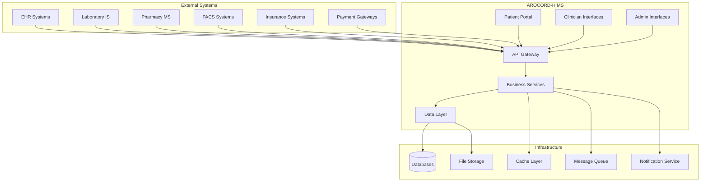

### 2.2 User Types and Interfaces

#### 2.2.1 User Categories
- **Patients**: Self-service portal for appointments, records, and communication
- **Healthcare Providers**: Doctors, nurses, pharmacists, lab technicians
- **Administrative Staff**: Receptionists, administrators, managers
- **External Systems**: Integration with EHR, LIS, PMS, and other healthcare systems

#### 2.2.2 Interface Types
- **Web Interfaces**: Responsive web applications for all user types
- **Mobile Interfaces**: Progressive Web App (PWA) support
- **API Interfaces**: RESTful APIs for system integration
- **Real-time Interfaces**: WebSocket connections for live updates

---

## 3. Technology Stack

### 3.1 Frontend Architecture

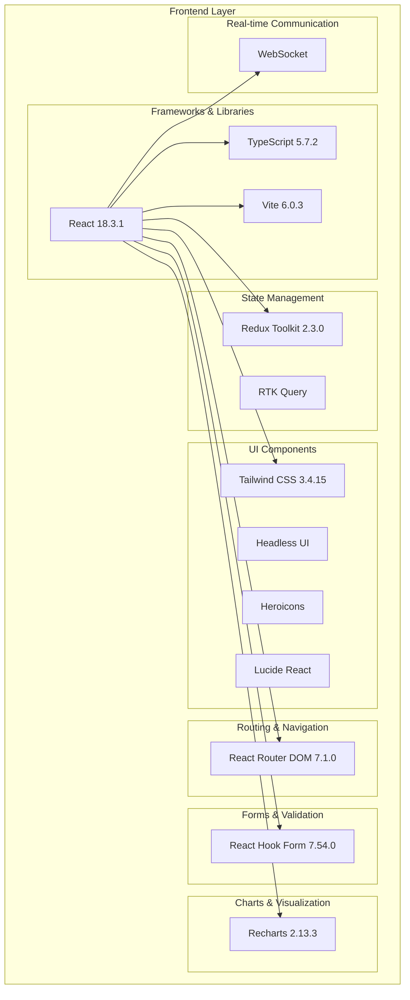

### 3.2 Backend Architecture

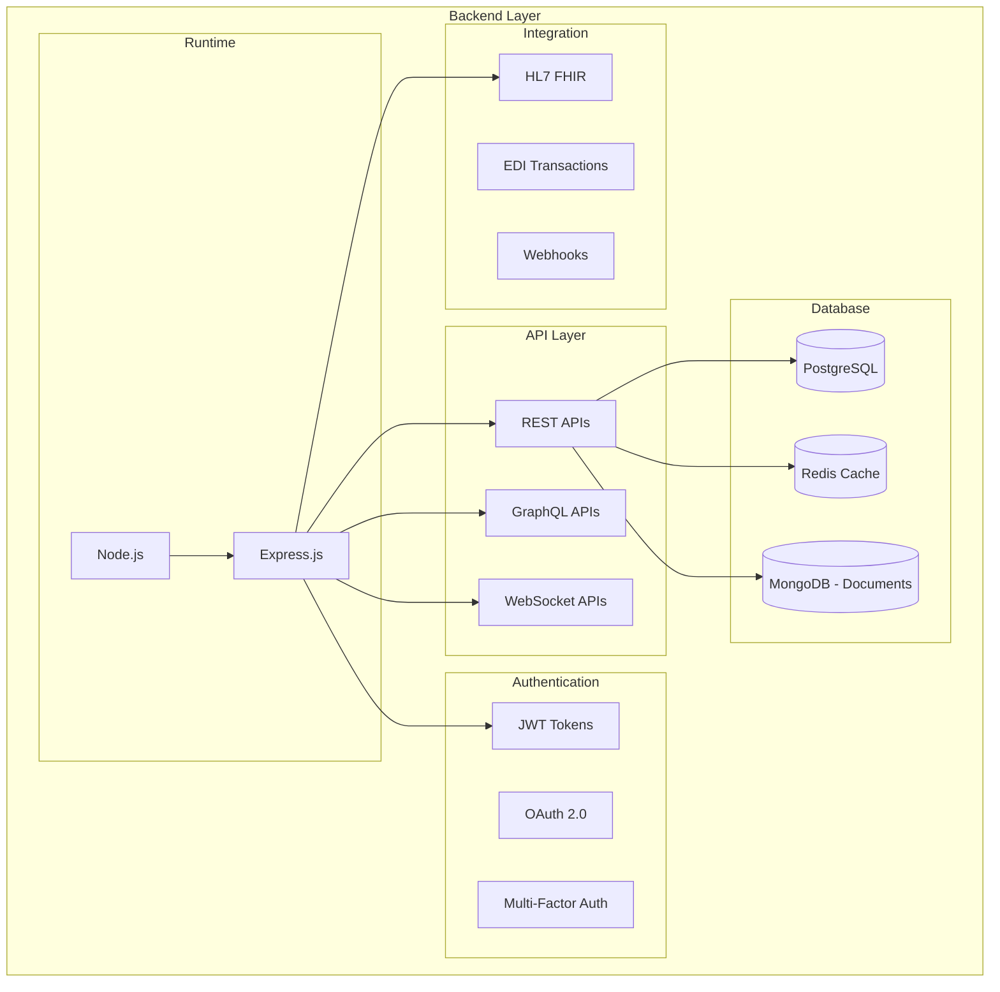

### 3.3 Infrastructure and DevOps

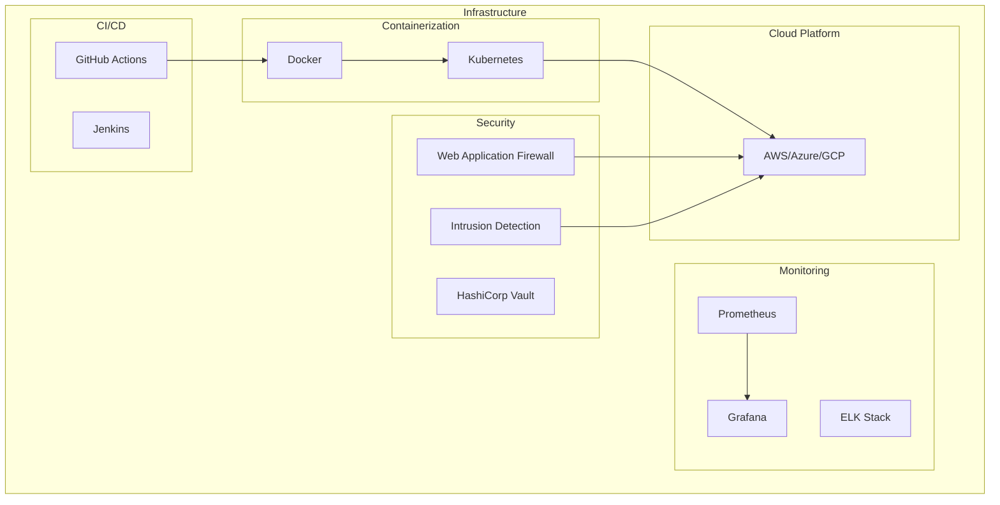

---

## 4. Component Architecture

### 4.1 Frontend Components

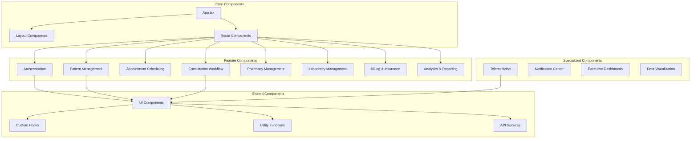

### 4.2 Backend Components

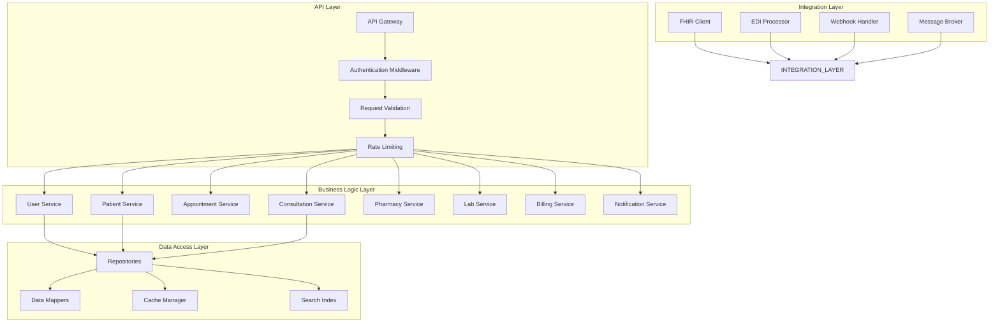

---

## 5. Data Architecture

### 5.1 Data Flow Architecture

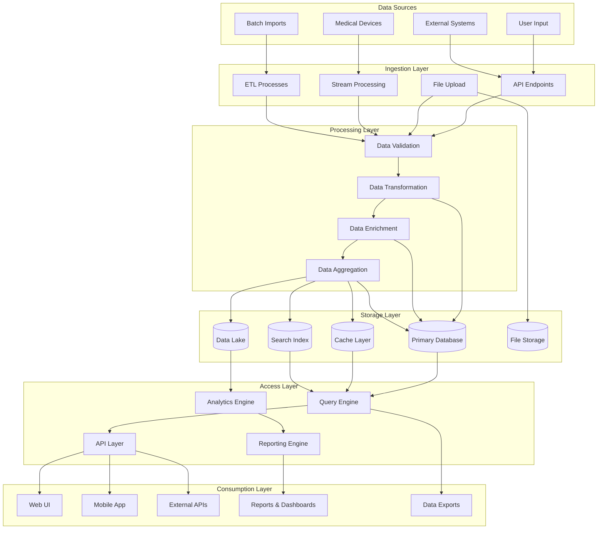

### 5.2 Database Schema Overview

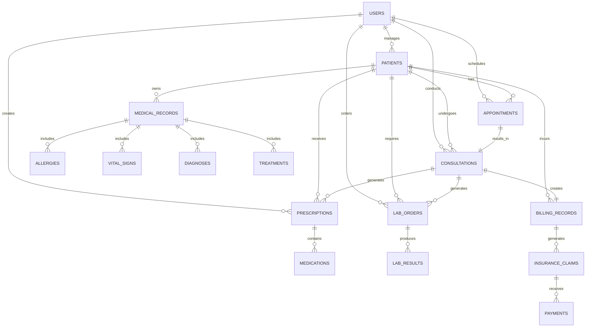

### 5.3 Data Storage Strategy

#### 5.3.1 Primary Database (PostgreSQL)
- **Purpose**: Transactional data storage with ACID compliance
- **Data Types**: Patient records, appointments, consultations, billing
- **Indexing Strategy**: Composite indexes for common query patterns
- **Partitioning**: Time-based partitioning for large tables

#### 5.3.2 Cache Layer (Redis)
- **Purpose**: High-performance data caching and session storage
- **Cache Types**: Application cache, session cache, query result cache
- **Eviction Policy**: LRU (Least Recently Used)
- **TTL Strategy**: Configurable time-to-live based on data type

#### 5.3.3 Document Storage (MongoDB)
- **Purpose**: Flexible storage for unstructured healthcare data
- **Data Types**: Clinical notes, unstructured reports, attachments
- **Indexing**: Text indexes for full-text search capabilities

#### 5.3.4 File Storage
- **Purpose**: Secure storage of medical documents and images
- **Features**: Encryption at rest, access logging, version control
- **Integration**: CDN integration for global access

---

## 6. Integration Architecture

### 6.1 Healthcare Standards Integration

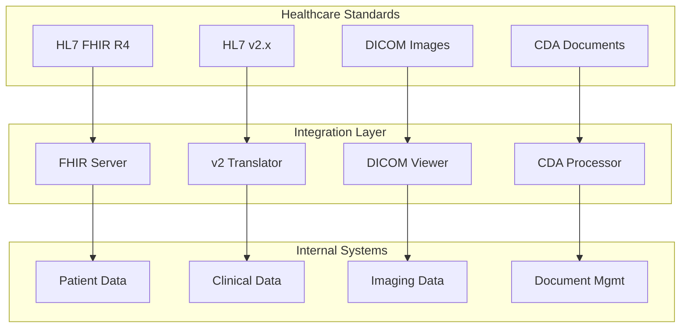

### 6.2 External System Integration

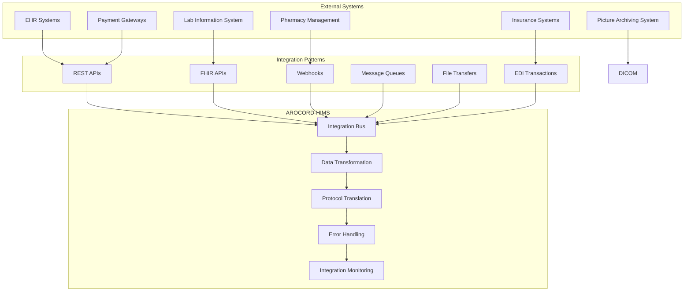

---

## 7. Deployment Architecture

### 7.1 Cloud Deployment Architecture

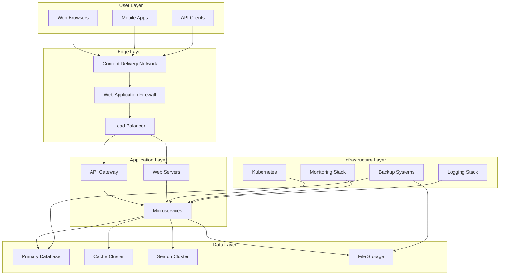

### 7.2 Containerization Strategy

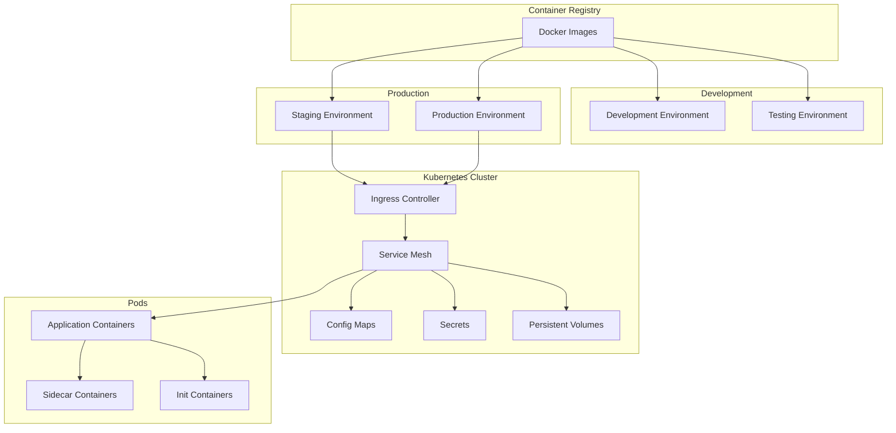

---

## 8. Security Architecture

### 8.1 Security Layers

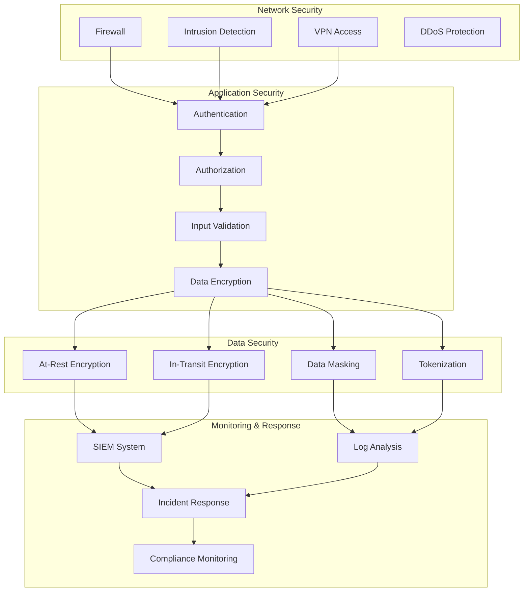

### 8.2 Authentication and Authorization

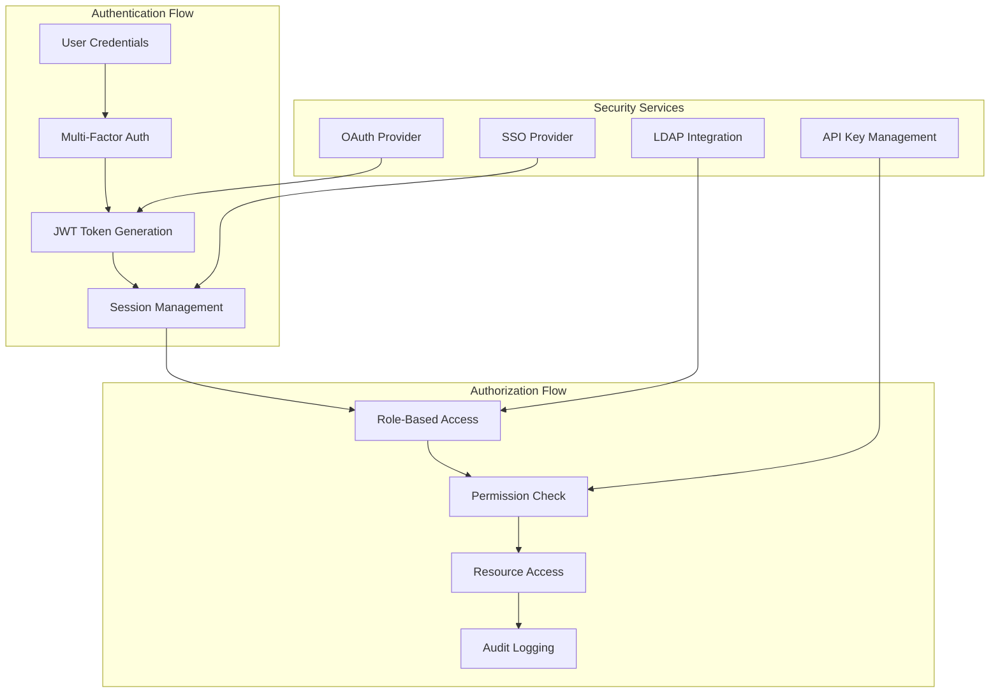

---

## 9. Performance and Scalability Architecture

### 9.1 Performance Optimization Strategies

```mermaid
graph TB
    subgraph "Frontend Optimization"
        CODE_SPLITTING[Code Splitting]
        LAZY_LOADING[Lazy Loading]
        IMAGE_OPTIMIZATION[Image Optimization]
        CACHING_STRATEGIES[Caching Strategies]
        CDN_DELIVERY[CDN Delivery]
    end

    subgraph "Backend Optimization"
        DATABASE_OPTIMIZATION[Database Optimization]
        API_OPTIMIZATION[API Optimization]
        CACHING_LAYER[Cache Layer]
        ASYNC_PROCESSING[Async Processing]
        LOAD_BALANCING[Load Balancing]
    end

    subgraph "Infrastructure Optimization"
        AUTO_SCALING[Auto Scaling]
        CONTAINER_ORCHESTRATION[Container Orchestration]
        MONITORING_ALERTS[Monitoring & Alerts]
        PERFORMANCE_PROFILING[Performance Profiling]
    end

    CODE_SPLITTING --> LAZY_LOADING
    LAZY_LOADING --> IMAGE_OPTIMIZATION
    IMAGE_OPTIMIZATION --> CACHING_STRATEGIES
    CACHING_STRATEGIES --> CDN_DELIVERY

    DATABASE_OPTIMIZATION --> API_OPTIMIZATION
    API_OPTIMIZATION --> CACHING_LAYER
    CACHING_LAYER --> ASYNC_PROCESSING
    ASYNC_PROCESSING --> LOAD_BALANCING

    AUTO_SCALING --> CONTAINER_ORCHESTRATION
    CONTAINER_ORCHESTRATION --> MONITORING_ALERTS
    MONITORING_ALERTS --> PERFORMANCE_PROFILING
```

### 9.2 Scalability Patterns

```mermaid
graph TB
    subgraph "Horizontal Scaling"
        LOAD_BALANCER[Load Balancer]
        APPLICATION_CLUSTER[Application Cluster]
        DATABASE_CLUSTER[Database Cluster]
        CACHE_CLUSTER[Cache Cluster]
    end

    subgraph "Vertical Scaling"
        RESOURCE_ALLOCATION[Resource Allocation]
        INSTANCE_SIZING[Instance Sizing]
        MEMORY_OPTIMIZATION[Memory Optimization]
    end

    subgraph "Data Scaling"
        DATABASE_SHARDING[Database Sharding]
        READ_REPLICAS[Read Replicas]
        DATA_PARTITIONING[Data Partitioning]
        ARCHIVE_STRATEGY[Archive Strategy]
    end

    subgraph "Application Scaling"
        MICROSERVICES[Microservices]
        EVENT_DRIVEN[Event-Driven Architecture]
        ASYNC_COMMUNICATION[Async Communication]
        CQRS_PATTERN[CQRS Pattern]
    end

    LOAD_BALANCER --> APPLICATION_CLUSTER
    APPLICATION_CLUSTER --> DATABASE_CLUSTER
    DATABASE_CLUSTER --> CACHE_CLUSTER

    RESOURCE_ALLOCATION --> INSTANCE_SIZING
    INSTANCE_SIZING --> MEMORY_OPTIMIZATION

    DATABASE_SHARDING --> READ_REPLICAS
    READ_REPLICAS --> DATA_PARTITIONING
    DATA_PARTITIONING --> ARCHIVE_STRATEGY

    MICROSERVICES --> EVENT_DRIVEN
    EVENT_DRIVEN --> ASYNC_COMMUNICATION
    ASYNC_COMMUNICATION --> CQRS_PATTERN
```

---

## 10. Monitoring and Observability

### 10.1 Monitoring Architecture

```mermaid
graph TB
    subgraph "Application Monitoring"
        APM[Application Performance Monitoring]
        ERROR_TRACKING[Error Tracking]
        LOG_AGGREGATION[Log Aggregation]
        METRIC_COLLECTION[Metric Collection]
    end

    subgraph "Infrastructure Monitoring"
        SERVER_MONITORING[Server Monitoring]
        CONTAINER_MONITORING[Container Monitoring]
        NETWORK_MONITORING[Network Monitoring]
        DATABASE_MONITORING[Database Monitoring]
    end

    subgraph "Business Monitoring"
        BUSINESS_METRICS[Business Metrics]
        SLA_MONITORING[SLA Monitoring]
        USER_EXPERIENCE[User Experience Monitoring]
        SECURITY_MONITORING[Security Monitoring]
    end

    subgraph "Alerting & Response"
        ALERT_MANAGER[Alert Manager]
        INCIDENT_RESPONSE[Incident Response]
        AUTO_REMEDIATION[Auto Remediation]
        NOTIFICATION_SYSTEM[Notification System]
    end

    APM --> ALERT_MANAGER
    ERROR_TRACKING --> ALERT_MANAGER
    LOG_AGGREGATION --> ALERT_MANAGER
    METRIC_COLLECTION --> ALERT_MANAGER

    SERVER_MONITORING --> ALERT_MANAGER
    CONTAINER_MONITORING --> ALERT_MANAGER
    NETWORK_MONITORING --> ALERT_MANAGER
    DATABASE_MONITORING --> ALERT_MANAGER

    BUSINESS_METRICS --> ALERT_MANAGER
    SLA_MONITORING --> ALERT_MANAGER
    USER_EXPERIENCE --> ALERT_MANAGER
    SECURITY_MONITORING --> ALERT_MANAGER

    ALERT_MANAGER --> INCIDENT_RESPONSE
    ALERT_MANAGER --> AUTO_REMEDIATION
    ALERT_MANAGER --> NOTIFICATION_SYSTEM
```

---

## 11. Architecture Decision Records

### 11.1 Key Architectural Decisions

#### ADR-001: Technology Stack Selection
**Decision**: Adopt React/TypeScript/Vite for frontend, Node.js/Express for backend
**Rationale**: Modern, performant, strong ecosystem, TypeScript for type safety
**Consequences**: Learning curve for team, but long-term maintainability benefits

#### ADR-002: State Management Approach
**Decision**: Use Redux Toolkit with RTK Query for API state management
**Rationale**: Predictable state management, built-in caching, TypeScript support
**Consequences**: More boilerplate code, but better debugging and testing

#### ADR-003: Database Selection
**Decision**: PostgreSQL as primary database, Redis for caching, MongoDB for documents
**Rationale**: ACID compliance for transactions, performance for caching, flexibility for documents
**Consequences**: Multiple database technologies to manage and maintain

#### ADR-004: API Design
**Decision**: RESTful APIs with GraphQL for complex queries
**Rationale**: Standard REST for CRUD operations, GraphQL for flexible data fetching
**Consequences**: Dual API maintenance, but better client experience

#### ADR-005: Deployment Strategy
**Decision**: Containerization with Kubernetes orchestration
**Rationale**: Scalability, portability, automated deployment
**Consequences**: Infrastructure complexity, but operational benefits

---

## 12. Future Architecture Considerations

### 12.1 Microservices Evolution
- **Current State**: Monolithic application with modular architecture
- **Future State**: Decomposed microservices for scalability
- **Migration Strategy**: Strangler pattern, domain-driven design

### 12.2 Cloud-Native Features
- **Serverless Functions**: For event-driven processing
- **Service Mesh**: For advanced traffic management
- **Event Streaming**: For real-time data processing

### 12.3 Advanced Analytics
- **Data Lake**: For big data analytics
- **Machine Learning**: For predictive analytics
- **Real-time Streaming**: For live dashboards

### 12.4 Edge Computing
- **Edge Deployment**: For low-latency telemedicine
- **IoT Integration**: For medical device connectivity
- **Offline Capabilities**: For remote healthcare scenarios

---

## Appendix A: Component Specifications

### Frontend Component Specifications
| Component | Technology | Purpose | Key Features |
|-----------|------------|---------|--------------|
| App.tsx | React | Main application component | Routing, layout, global state |
| Layout | React | Page layout wrapper | Navigation, breadcrumbs, notifications |
| Dashboard | React | Role-specific dashboard | KPIs, quick actions, recent activity |
| Forms | React Hook Form | Data entry forms | Validation, auto-save, error handling |
| Tables | Custom | Data display tables | Sorting, filtering, pagination, export |
| Charts | Recharts | Data visualization | Interactive charts, responsive design |

### Backend Service Specifications
| Service | Technology | Purpose | Key Features |
|---------|------------|---------|--------------|
| API Gateway | Express.js | Request routing | Authentication, rate limiting, logging |
| User Service | Node.js | User management | CRUD operations, role management |
| Patient Service | Node.js | Patient data | Demographics, history, records |
| Consultation Service | Node.js | Clinical workflows | Workflow management, validation |
| Pharmacy Service | Node.js | Medication management | Prescriptions, inventory, interactions |
| Notification Service | Node.js | Communication | Email, SMS, in-app notifications |

## Appendix B: Interface Specifications

### API Interface Specifications
```
Base URL: https://api.hims.arocord.com/v1
Authentication: Bearer Token (JWT)
Content-Type: application/json
Rate Limiting: 1000 requests per minute per client

Endpoints:
- GET /patients - List patients
- POST /patients - Create patient
- GET /patients/{id} - Get patient details
- PUT /patients/{id} - Update patient
- DELETE /patients/{id} - Delete patient

Response Format:
{
  "success": true,
  "data": { ... },
  "meta": { "pagination": { ... } },
  "errors": []
}
```

### WebSocket Interface Specifications
```
Protocol: WebSocket over WSS
Authentication: Token in query parameter
Heartbeat: Ping/pong every 30 seconds

Events:
- consultation:updated - Real-time consultation updates
- notification:new - New notification alerts
- appointment:reminder - Appointment reminders
- queue:updated - Queue status changes
```

---

## Document Control

- **Version**: 1.0
- **Last Updated**: January 2025
- **Approval Required**: Technical Lead and Architecture Review Board
- **Review Cycle**: Quarterly during development, annually post-launch
- **Document Owner**: Technical Architecture Team

---

**Approval Sign-off**

**Technical Lead**: ___________________________ Date: ____________

**System Architect**: ___________________________ Date: ____________

**DevOps Lead**: ___________________________ Date: ____________