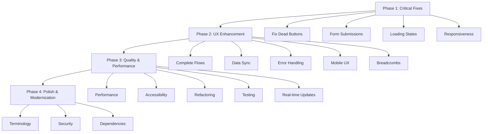

# AroCord HIMS Frontend Audit & Improvement Plan

## Executive Summary

The AroCord HIMS frontend is a comprehensive React-based hospital management system with distinct portals for Doctor, Nurse, Receptionist, Pharmacist, and Patient roles. Built with modern technologies (React 18, TypeScript, Vite, Tailwind CSS, Redux Toolkit), the application demonstrates solid architectural foundations with role-based routing and responsive design patterns.

**Strengths:**
- Well-structured component organization with reusable UI components
- Comprehensive role-based access control and navigation
- Extensive test coverage with Vitest and testing libraries
- Modern development setup with TypeScript and ESLint

**Major Pain Points:**
- Numerous non-functional buttons and interactive elements across all portals
- Inconsistent implementation of user flows and missing navigation handlers
- Potential accessibility gaps with incomplete ARIA support
- Code quality issues including prop drilling and missing error boundaries in some areas

**Estimated Effort:** High (6-8 weeks for full implementation with team of 3-4 developers)

## Prioritized Issues & Recommendations

### 1. User Flow & Navigation

**Critical Issues:**
- **Broken Navigation in Doctor Portal** - Consultation flow navigation incomplete; missing patient-specific routing
  - Location: `src/pages/doctor/consultation/ConsultationFlow.tsx`, `src/pages/doctor/Dashboard.tsx`
  - Severity: Critical
  - Recommended Fix: Implement dynamic routing with patient IDs, add navigation guards
  - Estimated Effort: Medium (1-2 days)

- **Incomplete Patient Registration Flow** - Wizard steps missing validation and progress persistence
  - Location: `src/pages/receptionist/patients/PatientRegistrationWizard.tsx`
  - Severity: High
  - Recommended Fix: Add form validation, implement step persistence with localStorage
  - Estimated Effort: Medium (2-3 days)

**Medium Issues:**
- **Inconsistent Breadcrumb Implementation** - Missing across most portals
  - Location: All portal pages
  - Severity: Medium
  - Recommended Fix: Create reusable Breadcrumb component, implement in all nested routes
  - Estimated Effort: Low (1 day)

### 2. Responsiveness & Cross-Device Compatibility

**High Issues:**
- **Mobile Layout Breaks in Complex Forms** - Patient registration and billing forms overflow on small screens
  - Location: `src/pages/receptionist/patients/PatientRegistration.tsx`, `src/pages/receptionist/billing/InvoiceGeneration.tsx`
  - Severity: High
  - Recommended Fix: Implement responsive grid layouts, add horizontal scroll containers where needed
  - Estimated Effort: Medium (2 days)

**Medium Issues:**
- **Touch Target Sizes** - Some buttons and interactive elements below 44px minimum
  - Location: Various dashboard cards and action buttons
  - Severity: Medium
  - Recommended Fix: Update Button component to enforce minimum touch targets, add padding utilities
  - Estimated Effort: Low (1 day)

### 3. Button & Interactive Element Functionality

**Critical Issues:**
- **Dead Buttons Across All Portals** - Hundreds of buttons without onClick handlers
  - Location: `src/pages/patient-portal/MyPrescriptions.tsx` (View Details), `src/pages/pharmacy/EnhancedDashboard.tsx` (View Details), `src/pages/nurse/Dashboard.tsx` (Ward Management), and many others
  - Severity: Critical
  - Recommended Fix: Implement placeholder functions or remove non-functional buttons, add proper navigation/modal triggers
  - Estimated Effort: High (1-2 weeks)

- **Missing Form Submissions** - Several forms lack submit handlers
  - Location: `src/pages/admin/Settings.tsx` (Save Changes), `src/pages/patient-portal/Profile.tsx` (Update Emergency Contact)
  - Severity: Critical
  - Recommended Fix: Implement form submission logic with API integration
  - Estimated Effort: Medium (3-4 days)

**High Issues:**
- **Inconsistent Loading States** - Some async operations lack loading indicators
  - Location: Various data-fetching components
  - Severity: High
  - Recommended Fix: Add loading spinners to Button component, implement in all async operations
  - Estimated Effort: Low (2 days)

### 4. Module Integration & Cross-Portal Consistency

**High Issues:**
- **Data Flow Gaps** - Patient data not consistently updated across portals
  - Location: State management in Redux slices
  - Severity: High
  - Recommended Fix: Implement real-time updates with WebSocket integration, add data synchronization
  - Estimated Effort: High (1 week)

**Medium Issues:**
- **Inconsistent Terminology** - Different labels for same actions (e.g., "View Details" vs "See More")
  - Location: Various components
  - Severity: Medium
  - Recommended Fix: Create design system documentation, standardize terminology
  - Estimated Effort: Low (1 day)

### 5. Overall Frontend Quality & Best Practices

**High Issues:**
- **Accessibility Gaps** - Missing ARIA labels, keyboard navigation incomplete
  - Location: Form components, navigation elements
  - Severity: High
  - Recommended Fix: Add comprehensive ARIA attributes, implement keyboard navigation patterns
  - Estimated Effort: Medium (3-4 days)

- **Performance Issues** - Potential unnecessary re-renders in complex components
  - Location: Dashboard components with frequent updates
  - Severity: High
  - Recommended Fix: Implement React.memo, useMemo for expensive calculations
  - Estimated Effort: Medium (2-3 days)

**Medium Issues:**
- **Error Handling** - Inconsistent error states and user feedback
  - Location: API calls and form submissions
  - Severity: Medium
  - Recommended Fix: Implement global error boundary, add toast notifications for all operations
  - Estimated Effort: Low (2 days)

- **Security Concerns** - Sensitive data potentially exposed in client-side storage
  - Location: Patient data handling
  - Severity: Medium
  - Recommended Fix: Implement proper data masking, avoid storing sensitive data in localStorage
  - Estimated Effort: Low (1 day)

## Implementation Roadmap

### Phase 1: Quick Wins & Critical Bug Fixes (1-2 weeks)
1. Fix all dead buttons and missing onClick handlers
2. Implement basic form submissions and navigation
3. Add loading states to async operations
4. Fix critical responsiveness issues in forms

### Phase 2: Flow and UX Enhancements (2-3 weeks)
1. Complete user flows with proper routing and validation
2. Implement cross-portal data synchronization
3. Add comprehensive error handling and user feedback
4. Improve mobile responsiveness across all components

### Phase 3: Refactoring, Performance, and Polish (1-2 weeks)
1. Optimize performance with memoization and lazy loading
2. Implement full accessibility compliance
3. Refactor code for better maintainability
4. Add comprehensive testing for critical paths

## Overall Task List

- [ ] **Phase 1: Critical Functionality Fixes**
  - [ ] Fix dead buttons and missing onClick handlers across all portals
  - [ ] Implement missing form submissions and validation
  - [ ] Add loading states to async operations
  - [ ] Fix critical responsiveness issues in forms and layouts

- [ ] **Phase 2: User Experience Enhancements**
  - [ ] Complete user flows with proper routing and navigation
  - [ ] Implement cross-portal data synchronization
  - [ ] Add comprehensive error handling and user feedback
  - [ ] Improve mobile responsiveness across all components
  - [ ] Create reusable Breadcrumb component

- [ ] **Phase 3: Quality and Performance**
  - [ ] Optimize performance with memoization and lazy loading
  - [ ] Implement full accessibility compliance
  - [ ] Refactor code for better maintainability
  - [ ] Add comprehensive testing for critical paths
  - [ ] Implement real-time updates with WebSocket integration

- [ ] **Phase 4: Polish and Modernization**
  - [ ] Standardize terminology across components
  - [ ] Implement proper data masking for sensitive information
  - [ ] Upgrade dependencies and implement modern patterns

## Implementation Workflow

## Additional Suggestions

1. **Upgrade Dependencies** - Update to latest React 18 features, consider React Query for data fetching
2. **Add Testing** - Increase unit test coverage, add integration tests for user flows
3. **Design System** - Create comprehensive component library with Storybook
4. **Monitoring** - Implement error tracking and performance monitoring
5. **Progressive Web App** - Add PWA capabilities for offline functionality

The application has strong potential but requires focused effort on functionality and user experience to achieve production readiness.