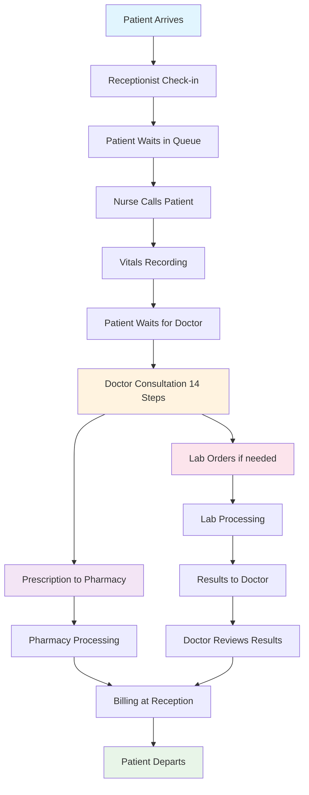
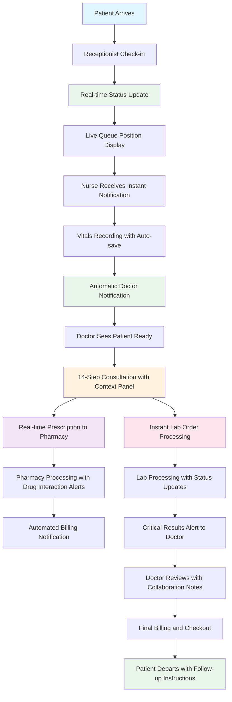
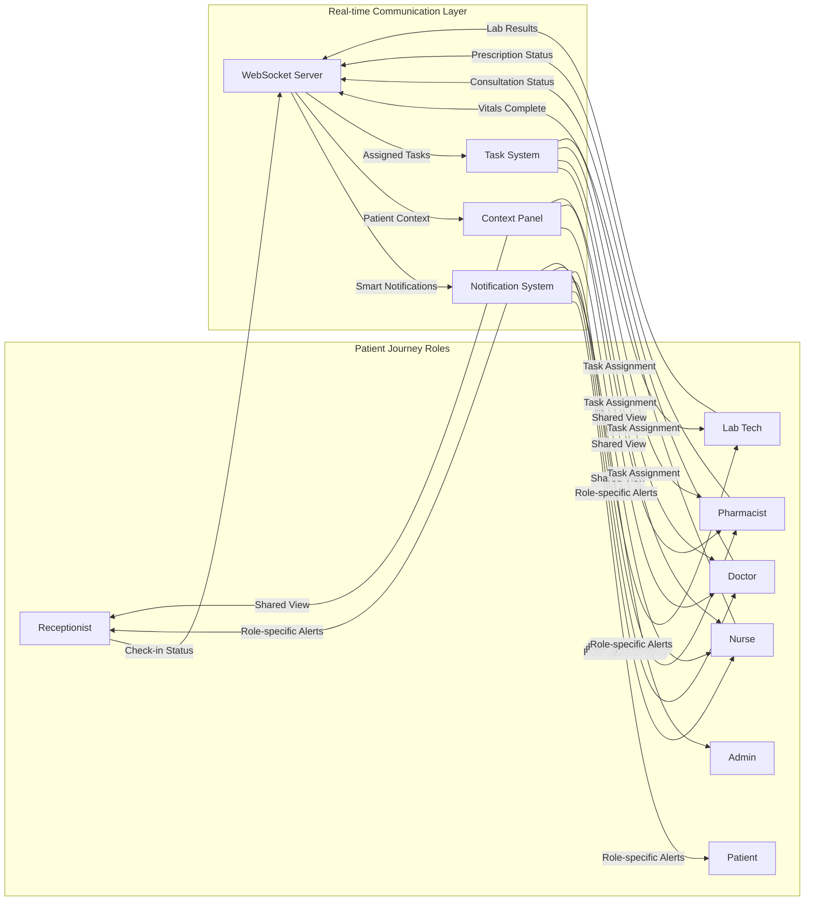
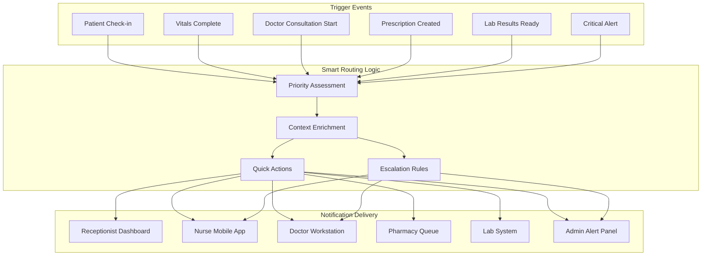
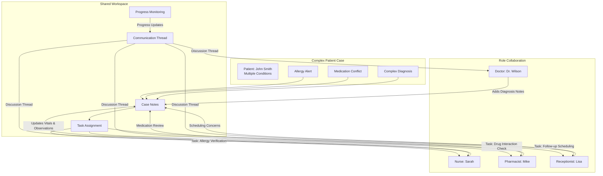
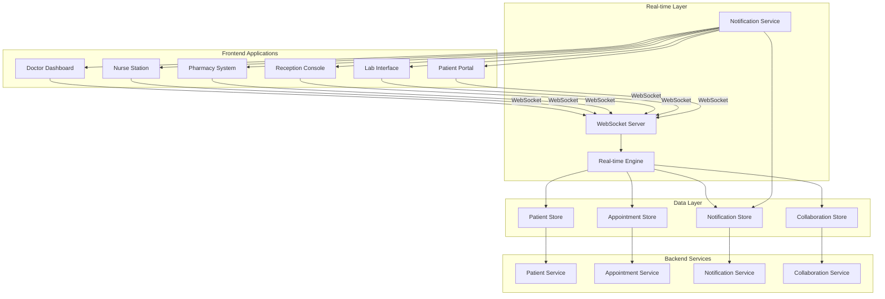
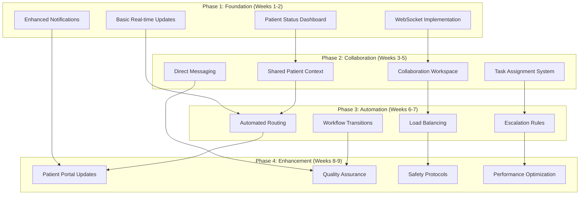
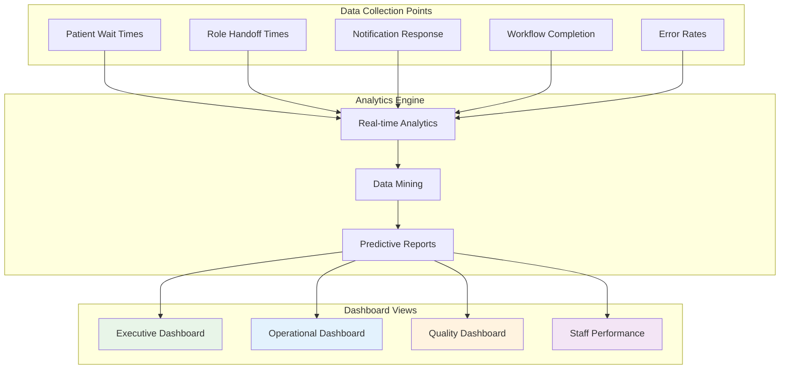

# Healthcare User Flow Optimization - Workflow Diagrams

## Current vs Enhanced User Flow Comparison

### Current Patient Journey Flow

### Enhanced Patient Journey Flow with Real-time Tracking

## Cross-Role Collaboration Flow

### Enhanced Role Communication Network

## Patient Status Dashboard Flow

### Real-time Patient Tracking System

```mermaid
graph TD
    subgraph "Patient Status States"
        S1[Scheduled]
        S2[Check-in Pending]
        S3[Check-in Complete]
        S4[Vitals Pending]
        S5[Vitals Complete]
        S6[Doctor Pending]
        S7[Consulting]
        S8[Prescription Pending]
        S9[Lab Orders Pending]
        S10[Complete]
    end
    
    S1 -->|Patient Arrives| S2
    S2 -->|Receptionist Completes| S3
    S3 -->|Auto-route to Nurse| S4
    S4 -->|Nurse Completes Vitals| S5
    S5 -->|Auto-notify Doctor| S6
    S6 -->|Doctor Starts Consult| S7
    S7 -->|Prescription Created| S8
    S7 -->|Lab Orders Created| S9
    S8 -->|Pharmacy Processes| S10
    S9 -->|Lab Completes| S10
    
    style S1 fill:#e3f2fd
    style S2 fill:#fff3e0
    style S3 fill:#e8f5e8
    style S4 fill:#fff3e0
    style S5 fill:#e8f5e8
    style S6 fill:#fff3e0
    style S7 fill:#e1f5fe
    style S8 fill:#f3e5f5
    style S9 fill:#fce4ec
    style S10 fill:#e8f5e8
```

## Notification Flow Enhancement

### Smart Notification Routing System

## Collaboration Workspace Flow

### Cross-Role Patient Coordination

## Data Flow Architecture

### Enhanced Data Synchronization

## Implementation Priority Flow

### Phased Implementation Approach

## Success Metrics Dashboard

### KPI Tracking Flow

---

## Key Enhancement Highlights

### Real-time Features
- **Live Patient Tracking**: Visual status indicators throughout patient journey
- **Instant Notifications**: Smart routing with contextual information
- **Collaborative Workspace**: Shared context across all roles
- **Automated Transitions**: Seamless handoffs between roles

### Collaboration Improvements
- **Shared Patient Context**: Unified view of patient information
- **Task Assignment**: Cross-role task coordination
- **Direct Communication**: Role-to-role messaging for specific patients
- **Progress Tracking**: Visual indicators of patient journey completion

### Safety Enhancements
- **Multi-role Verification**: Allergy and medication checks across roles
- **Critical Alert System**: Immediate notification for urgent situations
- **Double-check Protocols**: Automated verification for high-risk actions
- **Quality Assurance**: Built-in safety checks throughout workflows

### Performance Benefits
- **Reduced Wait Times**: Automated routing and load balancing
- **Improved Efficiency**: Streamlined workflows and quick actions
- **Better Communication**: Contextual notifications and collaboration
- **Enhanced Safety**: Multi-layer verification and alert systems